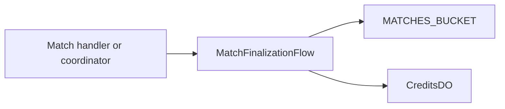

# Match Finalization Flow

**Purpose:** Finalizes a completed match, persists the final match record, and awards participation GP.

**Triggered by:** match finalization handling in the match request path.

**Touches:** `MATCHES_BUCKET`, `CreditsDO` via `earnGPLogic`.

**Does not:** orchestrate sibling Durable Objects from inside a Durable Object.

## How it works

1. Validate the finalize payload against the current match state.
2. Build the finalized state and persist the match record to R2.
3. Persist chat history and AI dump when present.
4. Award participation GP with a per-player idempotency key.
5. Return the final match state and archived record metadata.

## Related docs

- [Match Coordination](../features/match-coordination.md)
- [MatchCoordinatorDO](../durable-objects/MatchCoordinatorDO.md)
- [CreditsDO](../durable-objects/CreditsDO.md)
