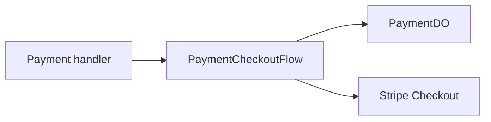

# Payment Checkout Flow

**Purpose:** Initializes payment state and creates a Stripe checkout session for a product purchase.

**Triggered by:** payment request handling and test-init setup.

**Touches:** `PaymentDO`, Stripe checkout sessions.

**Does not:** settle Stripe webhooks or credit the user directly. Settlement is handled by `StripeWebhookFlow`.

## How it works

1. Resolve the requested product and calculate the amount.
2. Create a new payment record in `PaymentDO`.
3. Build the Stripe checkout payload.
4. Create the checkout session and return the session URL.

## Related docs

- [Payments and Stripe](../features/payments-and-stripe.md)
- [PaymentDO](../durable-objects/PaymentDO.md)
- [StripeWebhookFlow](stripe-webhook-flow.md)
