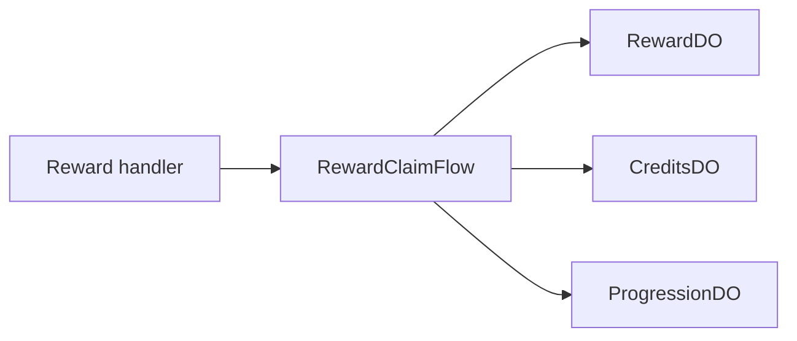

# Reward Claim Flow

**Purpose:** Handles daily claims, mission claims, mission progress, battle-pass claims, battle-pass XP, and streak freeze operations.

**Triggered by:** reward and progression request handling.

**Touches:** `RewardDO`, `CreditsDO`, `ProgressionDO`.

**Does not:** invent local idempotency semantics in the handler. The flow carries the operation ID through the full chain.

## How it works

1. Require an authenticated user.
2. Normalize the reward request into a flow input.
3. Build or reuse a stable operation ID.
4. Forward the mutation to `RewardDO`.
5. When the reward includes GP or XP, forward it to `CreditsDO` or `ProgressionDO`.

## Related docs

- [Credits and Economy](../features/credits-and-economy.md)
- [Progression](../features/profile.md)
- [RewardDO](../durable-objects/RewardDO.md)
- [CreditsDO](../durable-objects/CreditsDO.md)
- [ProgressionDO](../durable-objects/ProgressionDO.md)
