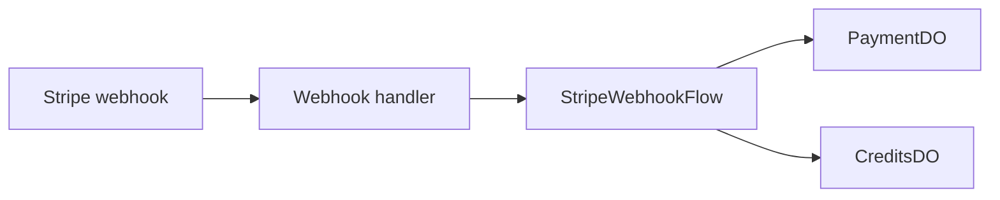

# Stripe Webhook Flow

**Purpose:** Ingests Stripe webhook events, dedupes them, updates payment state, and credits purchases when payment succeeds.

**Triggered by:** the Stripe webhook handler.

**Touches:** `PaymentDO`, `CreditsDO`, Stripe event metadata.

**Does not:** depend on local state in a Durable Object to coordinate other Durable Objects.

## How it works

1. Verify and parse the incoming Stripe event.
2. Resolve the user and payment IDs from the event payload.
3. Check whether the event was already processed in `PaymentDO`.
4. Store the event and transition payment state.
5. On successful payment, forward the AC purchase to `CreditsDO`.

## Related docs

- [Payments and Stripe](../features/payments-and-stripe.md)
- [PaymentDO](../durable-objects/PaymentDO.md)
- [CreditsDO](../durable-objects/CreditsDO.md)
