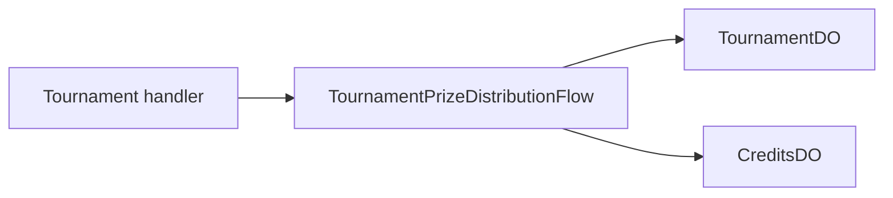

# Tournament Prize Distribution Flow

**Purpose:** Reads tournament winners and awards their GP prizes.

**Triggered by:** tournament prize distribution handling.

**Touches:** `TournamentDO`, `CreditsDO` via `earnGPLogic`.

**Does not:** rely on ad hoc per-handler payout loops.

## How it works

1. Require an authenticated user.
2. Load the tournament winners from `TournamentDO`.
3. Validate each winner record.
4. Build a stable prize idempotency key per winner.
5. Award GP through `CreditsDO` and collect failures.

## Related docs

- [TournamentDO](../durable-objects/TournamentDO.md)
- [CreditsDO](../durable-objects/CreditsDO.md)
- [Credits and Economy](../features/credits-and-economy.md)
