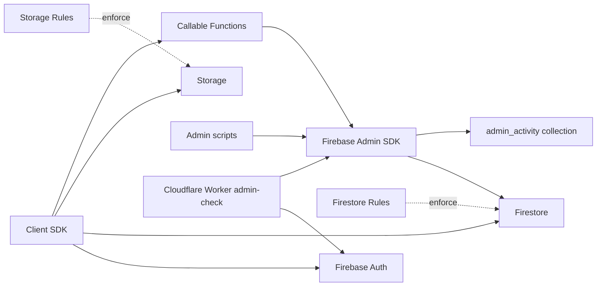
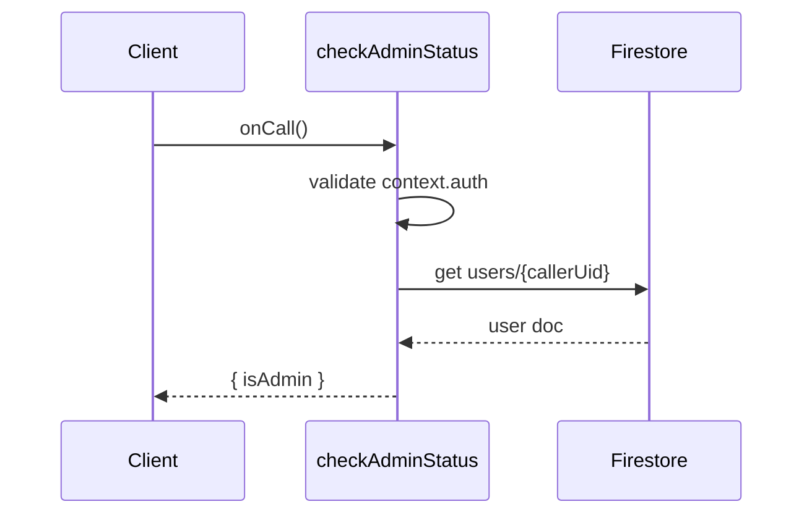
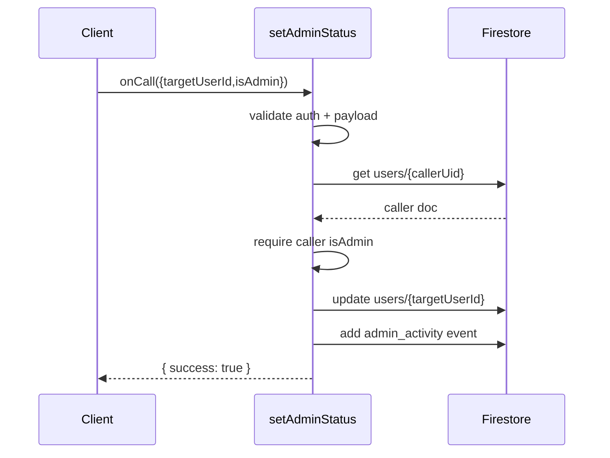
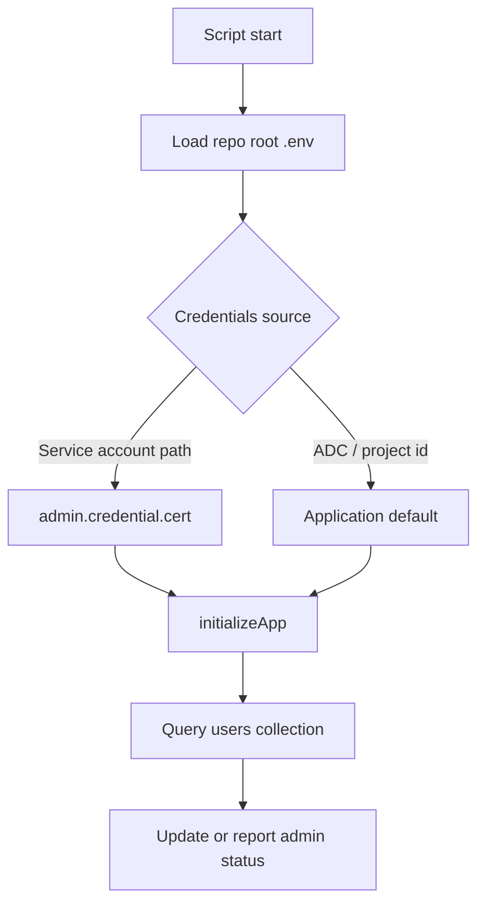

# Firebase Architecture

This document describes how `infra/firebase` currently works from code and config.

## Runtime state

- Firebase project aliases from `.firebaserc`: `default`, `production`, `development` all map to `claim-b020c`.
- Functions source: `functions/src/index.ts`.
- Functions runtime: Node.js 20 (`firebase.json` and `functions/package.json`).
- Callable functions:
  - `checkAdminStatus`
  - `setAdminStatus`
- Security boundaries:
  - Firestore rules: `rules/firestore.rules`

## Cloudflare worker integration

Admin endpoints in `infra/cloudflare` use Firebase in two separate ways:

1. verify client Firebase ID token (`Authorization` bearer token)
2. read Firestore role state (`users/{uid}.isAdmin`) using worker service-account auth

This means worker-side admin checks require:

- `FIREBASE_PROJECT_ID`
- `FIREBASE_SERVICE_ACCOUNT_JSON`

## High-level architecture

## Callable function flow

### `checkAdminStatus`

- Requires authenticated caller (`context.auth`).
- Reads caller document from `users/{uid}`.
- Returns `{ isAdmin: boolean }`.

### `setAdminStatus`

- Requires authenticated caller.
- Validates input payload (`targetUserId`, `isAdmin`).
- Confirms caller is admin by reading `users/{callerUid}.isAdmin`.
- Updates `users/{targetUserId}.isAdmin`.
- Appends audit event to `admin_activity`.

## Security rules behavior

### Firestore (`rules/firestore.rules`)

- `users/{userId}`:
  - read/create/update only by same authenticated user
  - update cannot modify `isAdmin`
  - delete denied
- `providerSecrets/{userId}`:
  - read/write only by same authenticated user
- `admin_activity/{activityId}`:
  - read only if caller is admin
  - write denied by rules (writes happen via Admin SDK in functions)
- `nonces/{nonceId}`:
  - read/write by any authenticated user
- everything else denied

## Admin scripts flow

- `scripts/set-admin-users.ts`:
  - loads `.env` from repo root
  - initializes Admin SDK (service account path or ADC/project id)
  - resolves users by email in `users` collection
  - sets `isAdmin: true`
- `scripts/check-admin-status.ts`:
  - same initialization path
  - checks one email or lists all users with `isAdmin == true`

