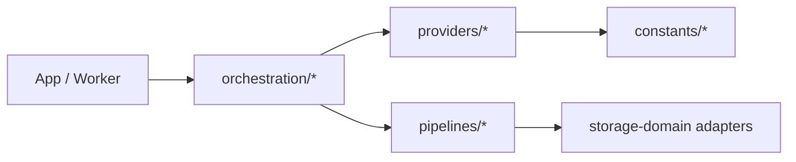

# @ocentra/ai-domain

AI domain package for provider abstractions, model catalogs, orchestration services, and pipeline/runtime adapters.

## What it contains

- Provider interfaces and provider implementations (`openai`, `anthropic`, `gemini`, `openrouter`, local providers).
- Model and pricing constants.
- Auth/oauth and token manager utilities.
- Inference and settings types.
- Orchestration services (`AIManager`, `AIEngine`, `ModelManager`).
- Pipeline modules (text generation, whisper, TTS).

## Architecture map



## Domain dependency flow

```mermaid
flowchart LR
  AI[@ocentra/ai-domain] --> Credentials[@ocentra/credentials-domain]
  AI --> Endpoint[@ocentra/endpoint-domain]
  AI --> Eventing[@ocentra/eventing-domain]
  AI --> Logging[@ocentra/logging-domain]
  AI --> Storage[@ocentra/storage-domain]
  AI --> Boundary[@ocentra/boundary-domain]
```

## Canonical docs

- `docs/README.md`
- `docs/ARCHITECTURE.md`
- `docs/OVERVIEW.md`

Use these docs as source of truth for module-level details.
