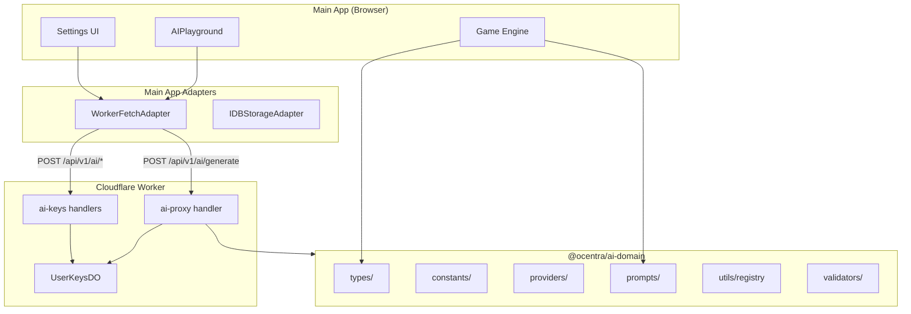
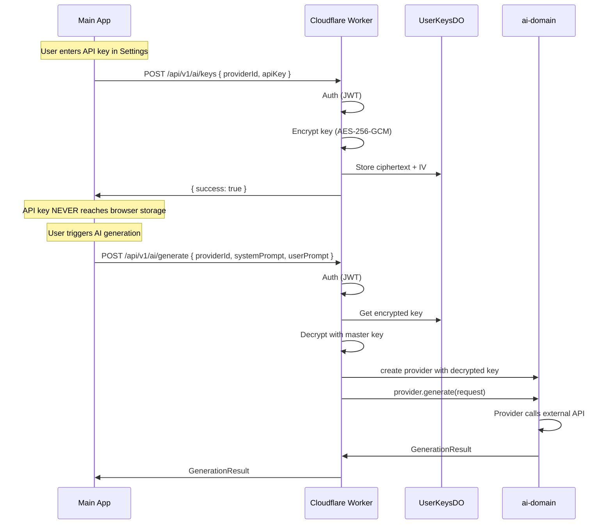
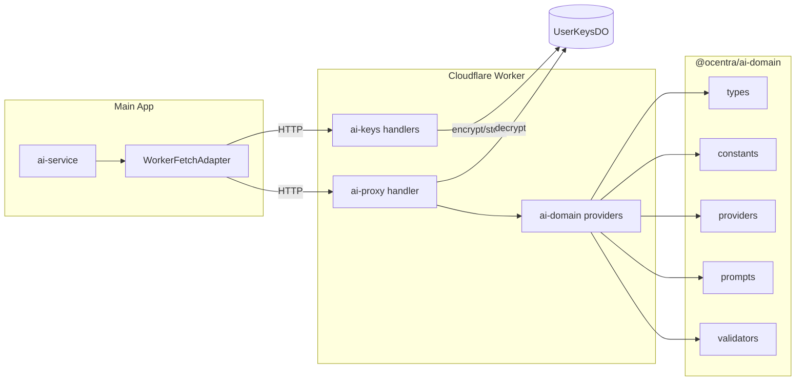
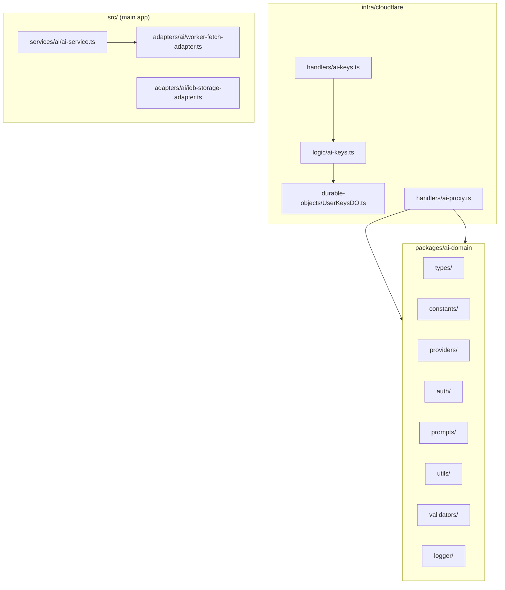
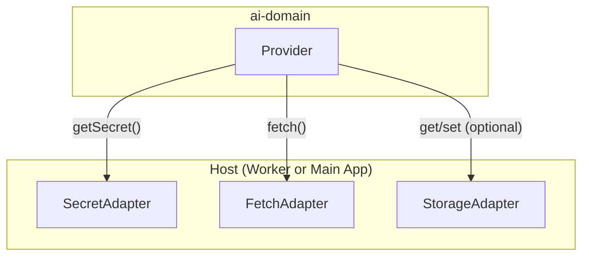
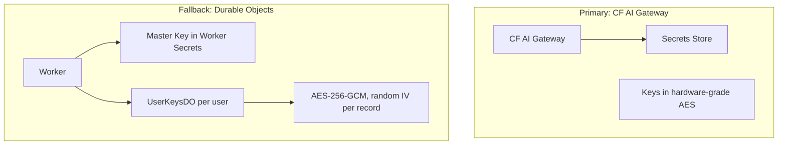

# AI Domain – Architecture

This document describes the ai-domain architecture. `@ocentra/ai-domain` is the single source of truth for AI: types, constants, provider logic, prompts, auth, and settings. The game engine, Cloudflare Worker, and main app consume from this package.

---

## What It Is

`@ocentra/ai-domain` is **pure logic**. It contains NO Firebase, Cloudflare APIs, DOM, or direct network calls. It receives adapters (Secret, Fetch, Storage) from the host and does not store API keys itself. The Cloudflare Worker owns key storage and decryption; the browser never sees API keys.

---

## System Overview



**Flow summary:** Main app calls worker endpoints. Worker uses ai-domain provider classes with real adapters. ai-domain provides types, constants, providers, and prompts; it does not call external APIs directly.

---

## Request Flow: Key Storage and AI Generation



---

## Component Connections



---

## What Lives Where



| Location | Contains |
|----------|----------|
| **packages/ai-domain** | Types, constants, providers, auth, prompts, registry, validators, logger |
| **infra/cloudflare** | AI key encryption, UserKeysDO, worker endpoints (ai-keys, ai-proxy) |
| **src/ (main app)** | Worker adapters, ai-service, UI (Settings, AIPlayground) |

---

## Adapter Pattern

ai-domain never imports host-specific code. The host provides adapters:



| Adapter | Purpose | Worker | Browser |
|---------|---------|--------|---------|
| **SecretAdapter** | API key retrieval | Reads from DO, decrypts | Returns null (worker holds keys) |
| **FetchAdapter** | HTTP requests | `globalThis.fetch` | Routes through worker proxy |
| **StorageAdapter** | Persistence (non-secret) | Optional | IndexedDB for UI preferences |

---

## Key Management: Two Tiers



- **BYOK:** Customer provides API key → encrypted on worker → free AI usage.
- **Platform AI:** Ocentra keys on worker → customer pays credits.

---

## Package Layout (ai-domain)

```
packages/ai-domain/
├── src/
│   ├── types/           # Interfaces, branded types
│   │   provider.ts      # ProviderId, ProviderType
│   │   config.ts        # BaseProviderConfig, ApiKeyProviderConfig
│   │   service.ts       # ILLMService
│   │   adapters.ts      # SecretAdapter, FetchAdapter, StorageAdapter
│   │   result.ts        # GenerationResult, ConnectionTestResult
│   │   inference.ts     # InferenceSettings
│   ├── constants/
│   │   auth-types.ts    # AuthType enum
│   │   errors.ts        # AIErrorCode, AIError
│   │   endpoints.ts     # Default base URLs
│   │   models.ts        # Default model lists
│   │   provider-catalog.ts
│   │   provider-categories.ts
│   ├── providers/       # One file per provider
│   │   base-provider.ts
│   │   openai-compatible.ts
│   │   openai.ts, anthropic.ts, gemini.ts, ollama.ts, ...
│   ├── auth/
│   │   oauth-types.ts, oauth-config.ts, oauth-flow.ts
│   │   token-manager.ts
│   ├── prompts/
│   │   prompt-types.ts, prompt-builder.ts
│   ├── utils/
│   │   provider-registry.ts, provider-manager.ts
│   │   local-discovery.ts
│   ├── validators/
│   │   config-validators.ts, request-validators.ts
│   └── logger/
│       runtime.ts, noop.ts
├── docs/
│   ├── ARCHITECTURE.md
│   └── README.md
└── package.json
```

---

## API Endpoints (Worker)

| Endpoint | Method | Purpose |
|----------|--------|---------|
| `/api/v1/ai/keys` | POST | Store encrypted API key |
| `/api/v1/ai/keys` | GET | List configured providers (IDs only) |
| `/api/v1/ai/keys/{providerId}` | DELETE | Remove key |
| `/api/v1/ai/keys/{providerId}/test` | POST | Test connection |
| `/api/v1/ai/generate` | POST | Run generation (systemPrompt, userPrompt, model, etc.) |

---

## Consumers

| Consumer | Uses |
|----------|------|
| Main app | Types, constants, prompt builder, provider catalog |
| Cloudflare Worker | Provider classes (with real adapters), validators, auth |
| Tests | Everything (with mock adapters) |

---

## Logger Setup

ai-domain uses an injectable logger. The host must call `initLogger(...)` before any ai-domain code runs.

**Main app:** Forward to app logger during bootstrap.

**Cloudflare Worker:** Forward to worker logger after `initLogger(env.ANALYTICS, ...)`.

**Tests:** Use `noopLogger` or mock; call `resetLogger()` in teardown.

Exports: `initLogger`, `setLogger`, `getLogger`, `resetLogger` from `@ocentra/ai-domain/logger/runtime`; `noopLogger` from `@ocentra/ai-domain/logger/noop`.

---

## Provider Categories

| Category | Providers | Auth |
|----------|-----------|------|
| Cloud API | OpenAI, Anthropic, Gemini, Groq, DeepSeek, Together, Fireworks, Perplexity, xAI, Mistral, Cohere | api_key / oauth2 |
| Aggregator | OpenRouter | api_key |
| Local Server | Ollama, LMStudio, vLLM, LocalAI, KoboldCpp | none |
| Browser | transformers.js, WebLLM | none |
| Native | Native app | none / bearer |

---

## Conventions

- No barrel imports; import from specific files (e.g. `@ocentra/ai-domain/types/provider`).
- Branded types: `ProviderId`, `ProviderType`, etc.
- Constants use `as const` pattern.
- Provider classes are NOT singletons; registry uses factories.
- camelCase method names.
- Security guarantees G1–G6 from project rules apply.

## Pipelines and Fetch (Platform Notes)

See also: `docs/ocentra/Architecture/platform-support-matrix.md` (host injection, quota recovery).

### DOM / Renderer vs Main Process

- Pipelines use DOM, fetch, Blob, and Web APIs. **Never run inference in Electron main** or Node-only environments without DOM polyfills.
- Run inference in **renderer/WebView only** (browser, Electron renderer, Capacitor WebView).
- React Native has memory limits; consider smaller models and test on devices.

### Fetch Injection

- Host **must** inject fetch when not in a browser. `globalThis.fetch` may differ in Node, workers, or edge runtimes.
- Use `wireFetchInterceptor(getConfig, { transformersEnv, baseFetch })` to wire the fetch interceptor.
- See `@ocentra/ai-domain/utils/wire-fetch-interceptor` and `fetch-intercept.ts` JSDoc.

### Build Target

- Pipeline code requires DOM for Blob, fetch, etc. Build target must include DOM.
- For Node-only builds (CLI, tests), exclude pipeline modules or provide stub implementations.

### OAuth / Deep Links

- Desktop and mobile handle OAuth redirects differently (deep links, custom URL schemes).
- Host must configure redirect URIs per platform.

---

## Shared Constants (endpoint-domain)

ai-domain depends on `@ocentra/endpoint-domain`. Do not redeclare constants that exist there. Import and use:

- `HttpMethod`, `HttpStatus`, `HttpHeader`, `ContentType`, `HttpAuthScheme` from `@ocentra/endpoint-domain/constants/http` when building providers or making HTTP calls
- `ErrorMessage` from `@ocentra/endpoint-domain/constants/errors` if mapping AI errors to API responses
- Branded types from `@ocentra/endpoint-domain/types/brands` if applicable

endpoint-domain and logging-domain remain pure (no imports from ai-domain); ai-domain imports from them without creating circular dependencies.
