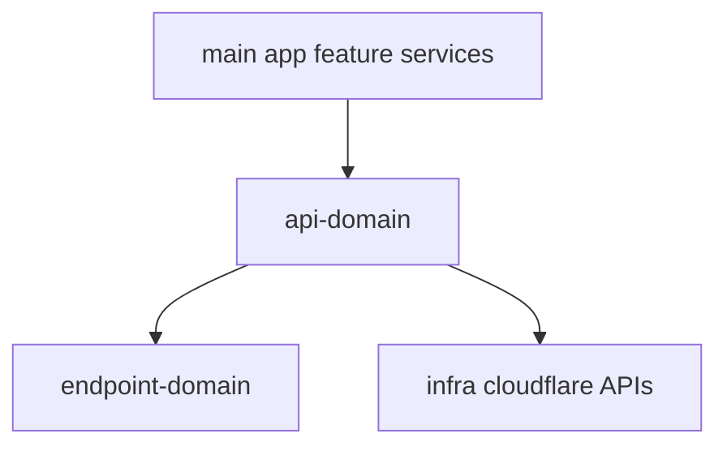

# @ocentra/api-domain Architecture

`@ocentra/api-domain` is the shared HTTP client/service layer for worker APIs.

## Owns

- API client creation and auth-token injection boundary
- Service clients grouped by feature area
- Cloud asset service adapters for app consumers

## Design

## Boundary Rules

- No raw endpoint strings; consume endpoint-domain constants.
- Keep business logic out of API client layer.
