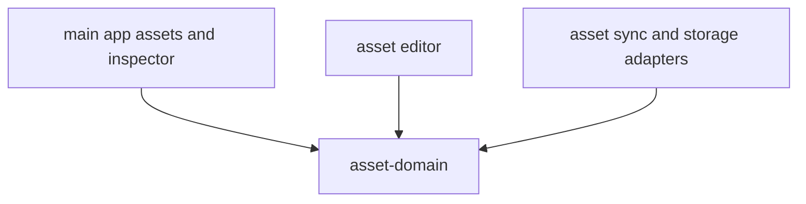

# @ocentra/asset-domain Architecture

`@ocentra/asset-domain` defines asset model contracts and serialization used by the app and tooling.

## Owns

- Resource entry hierarchy
- Serialization decorators and serializer
- Asset identifiers and asset-type constants
- Asset metadata contracts

## Design

## Boundaries

- Storage location and API routes are out of scope; those belong to boundary-domain and endpoint-domain.
- Domain remains runtime-agnostic and focused on data model + serialization behavior.
