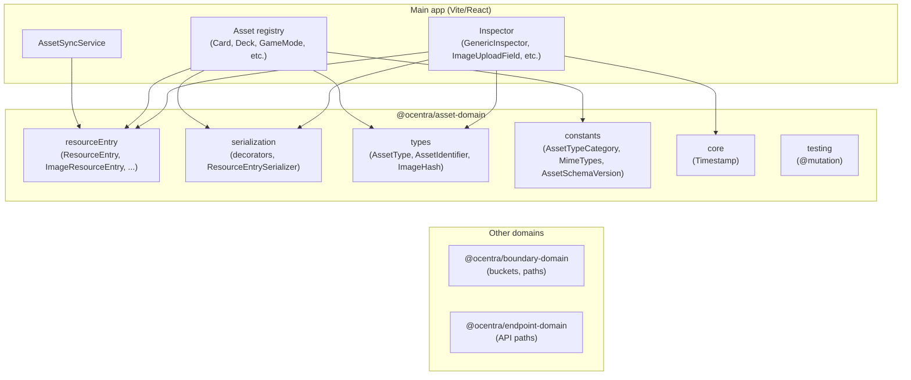

# @ocentra/asset-domain

Single source of truth for the **asset domain model** used by the main app: resource entries (files, images, folders, etc.), serialization with decorators, asset types and identifiers, and shared constants. Keeps asset structure, metadata, and serialization rules in one place so the app and any tooling stay in sync.

---

## What it does

This package provides:

- **ResourceEntry hierarchy** – Base class and concrete types: `AssetResourceEntry`, `ImageResourceEntry`, `FileResourceEntry`, `FolderResourceEntry`, `SoundResourceEntry`, `VideoResourceEntry`.
- **Serialization** – Decorators (`@serializable`, `@serializableClass`, `@required`) and `ResourceEntrySerializer` for consistent save/load and inspector metadata.
- **Types** – Branded types and helpers: `AssetType`, `AssetIdentifier`, `ImageHash`, `isAssetGUID`, `isImageHash`.
- **Constants** – `AssetTypeCategory`, `MimeTypes`, `AssetSchemaVersion` (no magic strings in app or worker).
- **Core** – `Timestamp` and related utilities used across asset metadata.
- **Testing** – `@mutation` and testing utilities for mutation testing in consumers.

The main app (inspector, asset registry, Card/Deck/GameMode assets, image upload) imports from here. Changing an asset shape or serialization rule is done in one package.

---

## Why it exists

The main app has many asset types (cards, decks, game rules, images, etc.) and a shared inspector and registry. Without a single domain package we get:

- **Duplication** – ResourceEntry-like classes or serialization logic copied across app and scripts.
- **Drift** – One place adds a field or changes a constant and others are missed.
- **No single contract** – “What is an AssetResourceEntry?” or “What MIME types do we use?” would be answered in multiple places.

Asset-domain exists so that **asset structure, types, and serialization** are defined once and consumed by the app (and any future worker or script that touches asset metadata).

---

## What it solves

| Problem | Solution |
|--------|----------|
| Inspector and assets use different ResourceEntry shapes | Both import from `@ocentra/asset-domain/resourceEntry` and `@ocentra/asset-domain/serialization`. |
| Card/Deck/GameMode each define their own serialization | They use `@serializable` and `ResourceEntrySerializer` from this package. |
| Magic strings for MIME types or schema versions | `MimeTypes`, `AssetSchemaVersion`, `AssetTypeCategory` live here. |
| Inconsistent asset type or identifier handling | `AssetType`, `AssetIdentifier`, `ImageHash`, `isAssetGUID` are the single source. |
| Mutation testing needs a shared decorator | `@mutation` and testing exports from `@ocentra/asset-domain/testing`. |

---

## How it connects to the rest of the system



- **Inspector** uses ResourceEntry types, serialization helpers, types (e.g. `ImageHash`), and `Timestamp`.
- **Asset registry / Card / Deck / GameMode** use `AssetResourceEntry`, serialization decorators, and constants.
- **AssetSyncService** uses `ResourceEntry` for sync and metadata.
- **boundary-domain** and **endpoint-domain** are separate: they own storage names and API shape; asset-domain owns asset structure and serialization.

---

## In scope vs out of scope

| In scope | Out of scope |
|----------|----------------|
| ResourceEntry class hierarchy | API routes, HTTP, R2 paths → endpoint-domain, boundary-domain |
| Serialization decorators and ResourceEntrySerializer | Where assets are stored (bucket/path) → boundary-domain |
| AssetType, AssetIdentifier, ImageHash, MimeTypes, AssetSchemaVersion | Business logic (scoring, rules) → main app or game engine |
| Timestamp and asset metadata shape | UI components (except types/constants they consume from here) |

---

## What’s inside

| Export | Purpose |
|--------|---------|
| `resourceEntry` | `ResourceEntry`, `AssetResourceEntry`, `ImageResourceEntry`, `FileResourceEntry`, `FolderResourceEntry`, `SoundResourceEntry`, `VideoResourceEntry`, types. |
| `serialization` | `@serializable`, `@serializableClass`, `@required`, `ResourceEntrySerializer`, `getSerializableFields`, `getRequiredFields`. |
| `constants/assets` | `AssetTypeCategory`, `MimeTypes`, `AssetSchemaVersion`. |
| `core/Timestamp` | `Timestamp` for asset metadata. |
| `types` | `AssetType`, `AssetIdentifier`, `ImageHash`, `isAssetGUID`, `isImageHash`, validators. |
| `testing` | `@mutation` and testing utilities for mutation testing in consumers. |

Prefer importing from the specific subpath you need (e.g. `@ocentra/asset-domain/serialization/decorators` or `@ocentra/asset-domain/serialization/ResourceEntrySerializer`).

---

## Usage

```ts
import { ImageResourceEntry, MimeTypes, Timestamp } from '@ocentra/asset-domain';
import { serializable, serializableClass, required } from '@ocentra/asset-domain/serialization/decorators';
import type { AssetIdentifier, ImageHash } from '@ocentra/asset-domain';
import { isAssetGUID, isImageHash } from '@ocentra/asset-domain';
import { AssetTypeCategory, AssetSchemaVersion } from '@ocentra/asset-domain';
import { ResourceEntrySerializer } from '@ocentra/asset-domain';
```

---

## Scripts

| Command | Purpose |
|--------|---------|
| `npm run build` | Compile and emit `.d.ts` (tsc, tsc-alias, fix-dts-aliases). |
| `npm run type-check` | `tsc --noEmit`. |
| `npm run lint` | ESLint on `src/**/*.ts` from repo root, then `tsc --noEmit`. |
| `npm run lint:eslint` | ESLint only. |
| `npm run lint:fix` | ESLint with autofix. |

---

## Relationship to other packages

- **boundary-domain** – Bucket names, R2 path prefixes. Use for “where” assets are stored.
- **endpoint-domain** – API paths, methods, headers. Use for “how” we call asset APIs.
- **asset-domain** – Asset structure, types, serialization. Use for “what” an asset is and how it’s serialized.

When adding a new ResourceEntry variant, a new constant used by multiple runtimes, or a change to serialization rules, do it here and rewire consumers to import from asset-domain.
