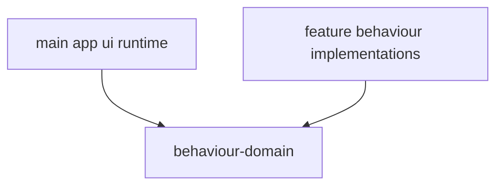

# @ocentra/behaviour-domain Architecture

`@ocentra/behaviour-domain` provides lifecycle-oriented behavior primitives used by UI and runtime components.

## Owns

- `ReactBehaviour` lifecycle base class
- Behavior hosting integration
- Hooks for behavior lifecycle and state access

## Design

## Boundary Rules

- Keep lifecycle mechanics in this domain package.
- Keep feature-specific behavior implementations in consumer packages/apps.
