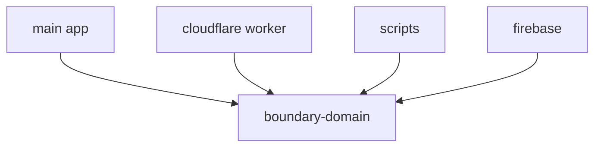

# @ocentra/boundary-domain Architecture

`@ocentra/boundary-domain` is the canonical source for shared boundary identifiers across runtimes.

## Owns

- R2 bucket names
- R2 key path prefixes
- Firestore collection names

## Consumers

- Main app (`src/*`)
- Cloudflare worker (`infra/cloudflare/*`)
- Scripts (`scripts/*`)
- Firebase infra (`infra/firebase/*`)

## Design

## Rules

- Do not hardcode bucket, path prefix, or collection names outside this package.
- Add new cross-runtime identifiers here first, then wire consumers.
