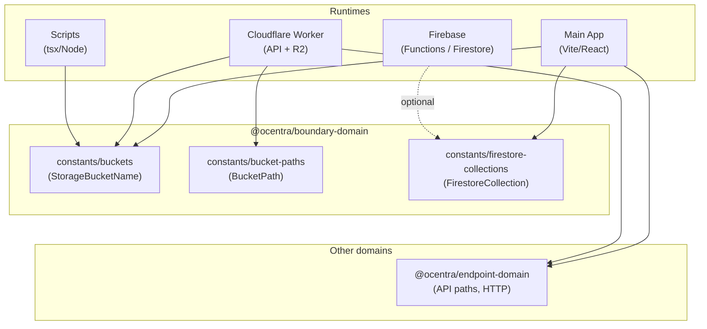

# @ocentra/boundary-domain

Single source of truth for **names and values that multiple runtimes must agree on** at the boundaries between the main app, Cloudflare worker, Firebase, and scripts. Prevents drift and mismatches when one side changes a bucket name, R2 key prefix, or Firestore collection name and the other does not.

---

## What it does

This package holds **shared constants** that define:

- **R2 bucket logical names** – which buckets exist and what we call them (`StorageBucketName`).
- **R2 key path prefixes** – how we partition keys inside the matches bucket (`BucketPath`).
- **Firestore collection names** – which collections the app and Firebase backend use (`FirestoreCollection`).

All runtimes that need these values **import from here** instead of defining their own copies. Changing a name in one place keeps app, worker, and scripts in sync.

---

## Why it exists

We have several runtimes that share infrastructure:

- **Main app** (Vite/React) – calls Cloudflare worker for R2, uses Firebase for auth/Firestore.
- **Cloudflare worker** – serves API, reads/writes R2 and uses path prefixes to organize data.
- **Firebase** (Functions, scripts) – use the same Firestore collections as the app.
- **Scripts** (Node/tsx) – upload or verify data in R2 using the same bucket names.

If each defines its own strings (`'ocentra-assets'`, `'users'`, `'matches/'`), we get:

- **Drift** – one place is updated and others are forgotten.
- **Bugs** – wrong bucket or collection name in one runtime.
- **No single place to look** – “what’s the matches bucket called?” is answered in one package.

Boundary-domain exists so that **agreement at the boundary** is explicit and maintained in one place.

---

## What it solves

| Problem | Solution |
|--------|----------|
| App and worker use different bucket names | Both import `StorageBucketName` from boundary-domain. |
| Worker uses path prefixes; app might need them later | `BucketPath` lives here; worker (and any script) imports it. |
| App and Firebase Functions use different collection names | Both can use `FirestoreCollection` (app already does; Functions can depend on this package). |
| Scripts hardcode `'claim-matches'` or `'ocentra-assets'` | Scripts import `StorageBucketName` and stay in sync with worker/config. |
| Test safety (“only clear test bucket”) | `StorageBucketName.TestMatches` is the single name for the test bucket. |

---

## How it connects to the rest of the system



- **Main app** uses `StorageBucketName` (e.g. for R2 config) and `FirestoreCollection` (Firestore `doc`/`collection`).
- **Cloudflare worker** uses `StorageBucketName` (e.g. test-bucket safety) and `BucketPath` (R2 key prefixes).
- **Scripts** use `StorageBucketName` when talking to R2.
- **Firebase** can use `FirestoreCollection` once Functions/scripts depend on this package (optional, for consistency).
- **endpoint-domain** is separate: it owns *how* we call APIs (paths, methods, headers). Boundary-domain owns *what we call* (bucket names, path prefixes, collection names). Both are “boundary” packages; one is request shape, the other is resource identity.

---

## In scope vs out of scope

| In scope | Out of scope |
|----------|----------------|
| R2 bucket logical names | API paths, HTTP methods, headers → `@ocentra/endpoint-domain` |
| R2 key path prefixes | Secrets, URLs, env values → env / deploy config |
| Firestore collection names | Business logic, types beyond “name” constants |

---

## What’s inside

| Export | Purpose |
|--------|---------|
| `constants/buckets` | `StorageBucketName`: DefaultAssets, DefaultMatches, TestMatches (R2 bucket names). |
| `constants/bucket-paths` | `BucketPath`: prefixes for matches, disputes, credits, badges, etc. (R2 key layout). |
| `constants/firestore-collections` | `FirestoreCollection`: Users, Nonces, AdminActivity. |

No barrel imports. Import from the specific file you need.

---

## Usage

```ts
import { StorageBucketName } from '@ocentra/boundary-domain/constants/buckets';
import { BucketPath } from '@ocentra/boundary-domain/constants/bucket-paths';
import { FirestoreCollection } from '@ocentra/boundary-domain/constants/firestore-collections';

// R2
const bucket = StorageBucketName.DefaultAssets;   // 'ocentra-assets'
const keyPrefix = BucketPath.UserCredits;         // 'user-credits/'

// Firestore
const usersRef = collection(db, FirestoreCollection.Users);  // 'users'
const docRef = doc(db, FirestoreCollection.Users, userId);
```

---

## Scripts

| Command | Purpose |
|--------|--------|
| `npm run build` | Compile and emit `.d.ts`. |
| `npm run type-check` | `tsc --noEmit`. |
| `npm run lint` | ESLint + type-check (run from repo root). |
| `npm run lint:fix` | ESLint with autofix. |

---

## Relationship to other packages

- **endpoint-domain** – API boundary (paths, methods, headers). Use for “where and how we call.”
- **boundary-domain** – Config/identity boundary (bucket names, path prefixes, collection names). Use for “what we call and where we put data.”
- **logging-domain**, **ai-domain**, **storage-domain**, **asset-domain** – No overlap; they don’t define these shared names.

When adding a new name or value that **more than one runtime** must use identically (app + worker, or app + Firebase, or scripts + worker), add it here and rewire consumers to import from boundary-domain.
