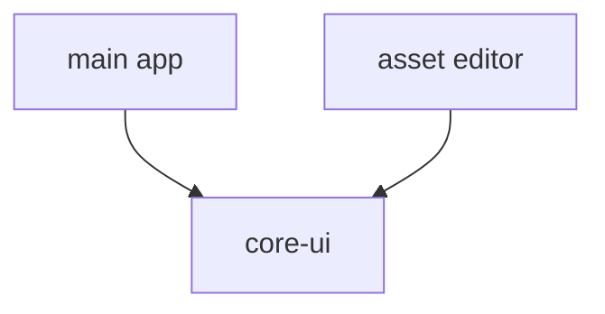

# @ocentra/core-ui Architecture

`@ocentra/core-ui` hosts shared UI components used by multiple app surfaces.

## Owns

- Reusable presentational components
- Shared component styling contracts
- Packaging and export boundaries for cross-app UI reuse

## Design

## Boundary Rules

- Keep components generic and dependency-light.
- Feature-specific page orchestration stays outside this package.
