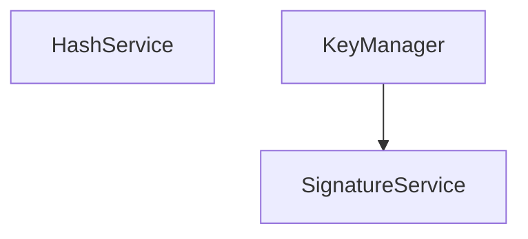
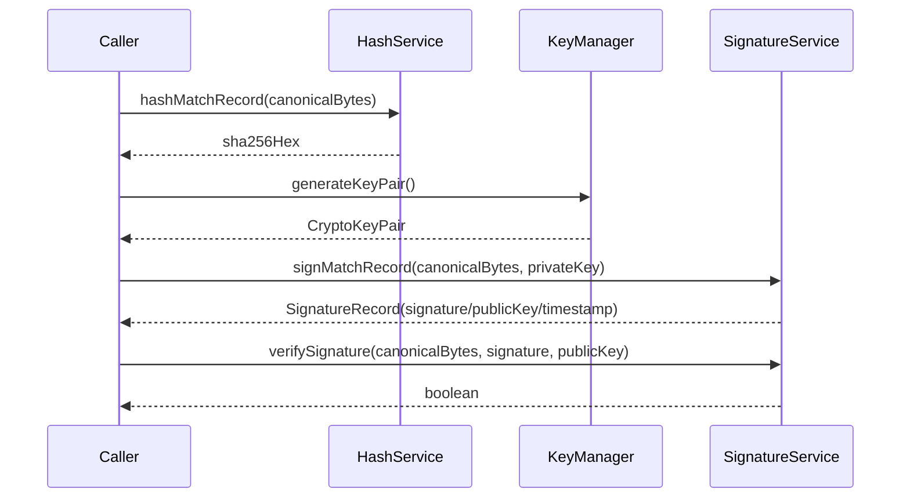

# crypto-domain — architecture

## Role

`@ocentra/crypto-domain` is a compact, dependency-free crypto layer for
cross-runtime hashing and Ed25519 operations.

## Module map



- `HashService` computes SHA-256 hex digests from canonical bytes or strings.
- `KeyManager` handles Ed25519 key generation and hex import/export.
- `SignatureService` signs/verifies canonical bytes; derives public key from private
  key material for signing metadata.

## Consumer view

```mermaid
flowchart LR
  APP[Main app] --> CRYPTO[@ocentra/crypto-domain]
  SOL[solana-domain] --> CRYPTO
  VERIFY[verification flows] --> CRYPTO
  SCRIPTS[CLI / scripts] --> CRYPTO
```

## Data flow



## Boundaries and guarantees

- No storage, network, or event bus integration in this package.
- No external npm runtime dependencies.
- All outputs are deterministic for a given input/key.
- API contract is intentionally narrow to reduce crypto drift across runtimes.
