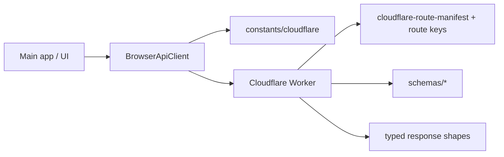

# @ocentra/endpoint-domain

## What this domain is

`@ocentra/endpoint-domain` is the single source of truth for the project’s **external request contracts**:
it defines canonical endpoint paths, the branded primitives used to represent them safely, the Effect Schema request/response validation schemas, and the typed client/route adapter utilities used by consumers.

This keeps the Cloudflare Worker, main app, Vite-local dev endpoints, Firebase callers, and third-party service clients (tokens/stripe/solana) from drifting into “each one hardcodes paths differently”.

## Why it exists

Without a shared endpoint contract layer, consumers start duplicating:

- raw path strings
- query/header names
- request/response shapes
- URL-building logic

That drift eventually becomes a security and correctness problem (wrong route, wrong schema, wrong idempotency/id parsing, unexpected enum/string coercions).

## Responsibility boundary (ownership rule)

This domain owns anything “endpoint-related”:

- canonical path constants for each scope (public REST, local dev, firebase callables, token/stripe/solana paths)
- request/response types and Effect Schema schemas
- route manifest/key tables for the Worker router
- typed thin clients/adapters and URL building helpers
- validators and shared error/message constants used at endpoint boundaries

Apps and handlers **consume** these constants/types/schemas; they must not invent their own endpoint strings or endpoint routing patterns.

## What code is inside (practical map)

The package is organized by purpose:

- `src/constants/*`  
  - scope-specific endpoint path constants (Cloudflare REST, Cloudflare DO paths, local `/local/api/*`, firebase callable names, tokens, stripe, solana)
  - shared HTTP/query/hostname/environment/idempotency/path utilities (as constants)
- `src/types/*`  
  - branded primitives (e.g. `ApiPath`, `DOPath`, `EndpointId`, query/header brands)
  - request/response types per scope (e.g. `types/cloudflare/*`)
- `src/schemas/*`  
  - Effect Schema validation schemas per scope (matches/credits/players/logs/etc.)
- `src/client/*`  
  - typed thin clients (browser/client and worker internal DO clients)
- `src/utils/*`  
  - URL building helpers (`buildApiUrl`, DO URL builders)
  - path parsing/sanitization/validation helpers used by boundary code
- `src/validators/*`  
  - boundary validators such as idempotency key and path parameter validation
- `src/openapi/*`  
  - OpenAPI artifacts derived from the endpoint contract layer

## How consumers use it

Typed clients and handlers import **specific entrypoints** (no barrel imports):

```ts
import { ApiEndpoint } from '@ocentra/endpoint-domain/constants/cloudflare';
import { buildApiUrl } from '@ocentra/endpoint-domain/utils/url-builder';
import type { ApiPath } from '@ocentra/endpoint-domain/types/brands';
import { CloudflareRouteManifest } from '@ocentra/endpoint-domain/constants/cloudflare-route-manifest';
import { BrowserApiClient } from '@ocentra/endpoint-domain/client/browserClient';
```

### End-to-end flow (high-level)



## Deep docs (where to go next)

- `docs/ARCHITECTURE.md`  
  Full package structure and endpoint inventory.
- `docs/DESIGN-CONVENTIONS.md`  
  Mandatory rules (branded types, full-path leaves, DO separation, and “no raw strings”).
- Repo-wide asset delivery mental model (Worker `download-url`, consumers): `../../docs/ocentra/asset-handling.md`
- Runtime resolve helper (shared by main app and tooling): `src/utils/resolve-asset-download-url.ts` → export `@ocentra/endpoint-domain/utils/resolve-asset-download-url`
