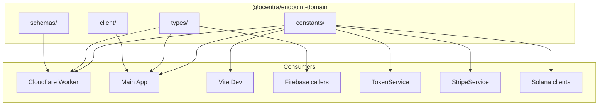
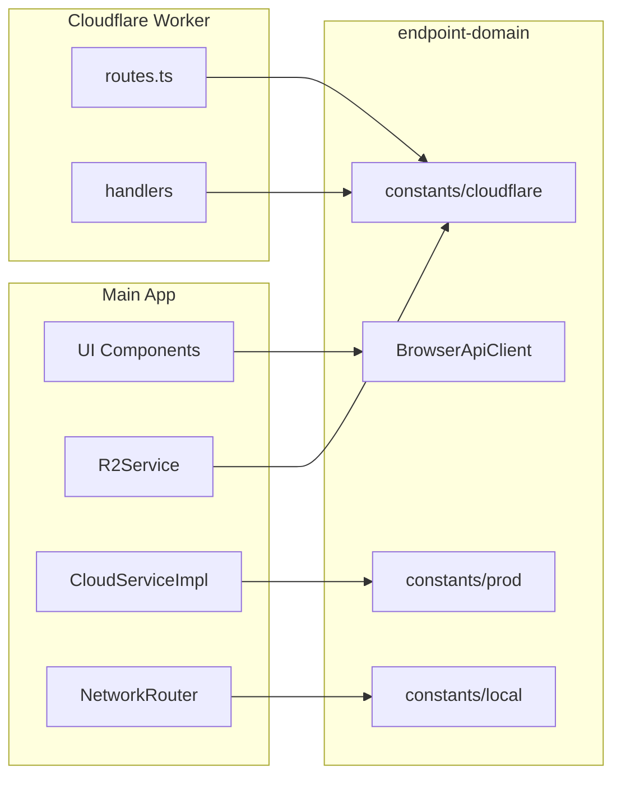
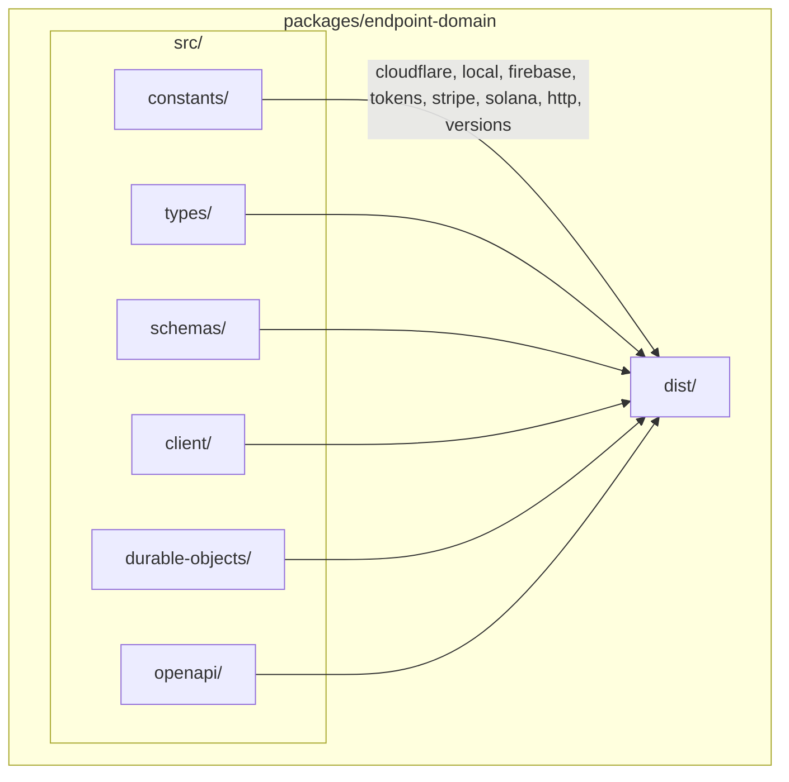
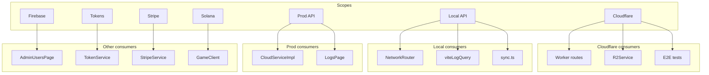
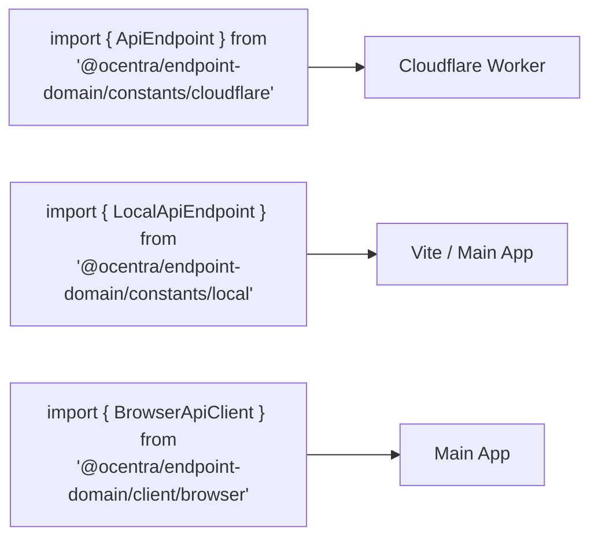
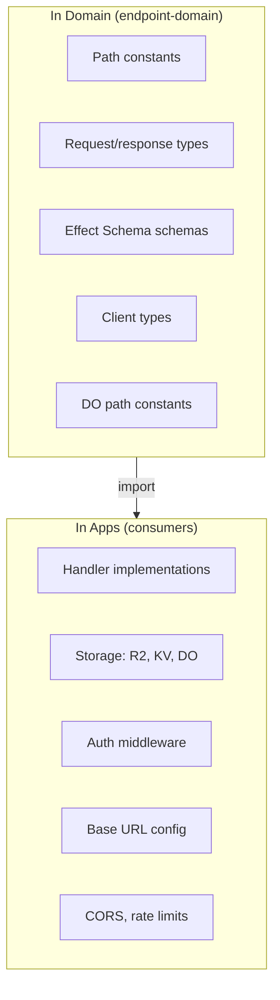
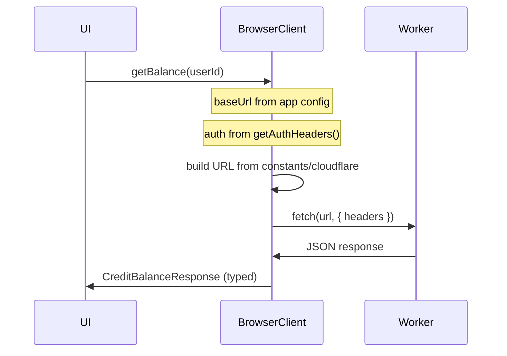

# Endpoint Domain – Architecture

**Single source of truth for all API endpoints:** Cloudflare Worker, Local API, Firebase, Tokens, Stripe, Solana.

**Last Updated:** 2026-02-10

**Conventions:** All constants and types MUST follow [DESIGN-CONVENTIONS.md](./DESIGN-CONVENTIONS.md). No raw strings, no exceptions.

**Related:**
- [DESIGN-CONVENTIONS.md](./DESIGN-CONVENTIONS.md) - **MANDATORY** rules for endpoints
- [`infra/cloudflare/ARCHITECTURE.md`](../../infra/cloudflare/ARCHITECTURE.md) - Cloudflare Worker implementation

| Doc | Purpose |
|-----|---------|
| [DESIGN-CONVENTIONS.md](./DESIGN-CONVENTIONS.md) | **MANDATORY** rules: branded types, nested paths, versioning, DO separation |

---

## What It Is

`@ocentra/endpoint-domain` is the **single source of truth** for API contracts. No scattered strings, no duplicated types. One package defines paths, request/response shapes, validation schemas, and typed HTTP clients. Cloudflare Worker, main app, Vite dev middleware, Firebase callers, TokenService, StripeService, and Solana clients all consume from here.



---

## How It Fits Together



**Request flow example:** User clicks "Get balance" → UI calls `browserClient.credits.getBalance(userId)` → BrowserClient (from domain) builds URL from `constants/cloudflare`, adds auth, fetches → Worker receives request, routes using same constants, handler returns typed response.

---

## Package Structure



```
packages/endpoint-domain/
├── src/
│   ├── constants/           # Path constants per scope (see DESIGN-CONVENTIONS)
│   │   ├── cloudflare.ts    # Cloudflare Worker REST only (public API)
│   │   ├── cloudflare-do.ts # Durable Object paths (internal; separate file)
│   │   ├── local.ts         # Vite /local/api/*
│   │   ├── firebase.ts      # Callable function names
│   │   ├── tokens.ts        # Tokens API paths
│   │   ├── stripe.ts        # Stripe API paths
│   │   ├── solana.ts        # RPC URLs, program IDs
│   │   ├── http.ts          # HttpMethod, HttpStatus
│   │   └── versions.ts      # ApiVersion.V1, etc.
│   ├── types/               # Branded primitives + request/response
│   │   ├── brands.ts        # ApiPath, DOPath, EndpointId
│   │   └── cloudflare/      # Request/response per domain
│   ├── schemas/             # Effect Schema validation
│   ├── client/              # BrowserApiClient, CloudflareApiClient
│   ├── durable-objects/
│   └── openapi/
├── docs/
│   ├── DESIGN-CONVENTIONS.md  # MANDATORY rules
│   ├── ARCHITECTURE.md
│   └── (index removed; use package README.md)
└── package.json
```

**Path conventions:** Nested by domain, full path at every leaf. Version in path (`/api/v1/...`). All paths branded as `ApiPath` or `DOPath`. See [DESIGN-CONVENTIONS.md](./DESIGN-CONVENTIONS.md).

---

## Scope Map

Endpoints are grouped by scope. Each scope has its own constant file and consumers.



| Scope | Constant file | What it defines | Consumers |
|-------|---------------|-----------------|-----------|
| **Cloudflare** | cloudflare.ts | Worker REST paths only | Worker routes, R2Service, tests |
| **Cloudflare DO** | cloudflare-do.ts | Durable Object paths (internal) | Worker internal fetch |
| **Local** | local.ts | `/local/api/*` paths | NetworkRouter, viteLogQuery, sync |
| **Prod** | prod (or cloudflare subset) | Main app → Worker paths | CloudServiceImpl, LogsPage |
| **Firebase** | firebase.ts | Callable names | AdminUsersPage |
| **Tokens** | tokens.ts | Tokens API paths | TokenService |
| **Stripe** | stripe.ts | Stripe paths | StripeService |
| **Solana** | solana.ts | RPC URLs, program IDs | WalletAdapter, GameClient |

---

## Import Model (No Barrel)

Every consumer imports from a **specific file**. No `index.ts`, no `@ocentra/endpoint-domain`.



---

## Domain vs Apps



| In Domain | In Apps |
|-----------|---------|
| Endpoint path constants (branded ApiPath, DOPath) | Handler implementations |
| Request/response types | Storage (R2, KV, DO) |
| Effect Schema validation schemas | Auth middleware |
| Base client types | Base URL configuration |
| DO path constants (cloudflare-do.ts) | CORS, rate limiting |

### Responsibility boundary (ownership rule)

**Anything to do with endpoints is endpoint-domain's responsibility — not Cloudflare's, not the main app's, not any other consumer's.**

- Domain owns: paths, path patterns for routing, route specs, types, schemas.
- Consumers do not: define paths, invent routing patterns, or keep endpoint-related constants.
- Flow: (1) Add or change endpoint contract in domain, (2) consumers import and use it, (3) **delete** any code in consumers (e.g. Cloudflare) that defines paths or routing patterns.
- Duplicate or improvised endpoint logic in consumers is forbidden. If it exists, move it to domain and remove it from the consumer.

---

## Client Adapter Pattern

The domain provides **typed clients** that are thin adapters. Base URL and auth come from the app.



---

## Endpoint Inventory (Canonical)

Canonical paths. Constants must match exactly. Version in path from day one.

### Cloudflare Worker (REST)

| Section | Endpoints |
|---------|-----------|
| Root & Health | `/`, `/health` |
| Explore | `/explore`, `/explore/leaderboard`, `/explore/benchmark` |
| Explore API | `/api/v1/explore/matches`, `/api/v1/explore/benchmarks` |
| Matches | `/api/v1/matches/{matchId}` GET/PUT/POST/DELETE, `/api/v1/matches/{matchId}/anonymize`, `/api/v1/matches/{matchId}/ai-decisions` |
| Disputes | `/api/v1/disputes` POST, `/api/v1/disputes/{disputeId}` GET, `/api/v1/disputes/{disputeId}/evidence` POST |
| Data | `/api/v1/signed-url/{matchId}` GET, `/api/v1/archive/{matchId}` POST, `/api/v1/data-export/{userId}` GET, `/api/v1/data/{userId}` DELETE |
| AI | `/api/v1/ai` POST, `/api/v1/ai/on_event` POST |
| Leaderboard | `/api/v1/leaderboard/{gameType}` GET, `/api/v1/leaderboard/{gameType}/user/{userId}`, `/api/v1/leaderboard/{gameType}/nearby/{userId}` |
| Players | `/api/v1/players/{userId}`, `/api/v1/players/{userId}/stats`, `/api/v1/players/{userId}/learning`, `/api/v1/players/{userId}/report` |
| Credits | `/api/v1/credits/{userId}/balance`, `/api/v1/credits/{userId}/transactions`, `/api/v1/credits/{userId}/award`, `/api/v1/credits/{userId}/purchase`, `/api/v1/credits/{userId}/consume` |
| Badges | `/api/v1/badges`, `/api/v1/badges/{badgeId}`, `/api/v1/badges/{userId}/progress`, `/api/v1/badges/{userId}/award` |
| Logs | `/api/v1/logs`, `/api/v1/logs/query`, `/api/v1/logs/stats`, `/api/v1/logs/sql`, `/api/v1/logs/test-sql` |
| Resources | `/api/v1/resources` GET/DELETE |
| Assets | `/api/v1/assets`, `/api/v1/assets/{assetId}` GET/PUT/DELETE |
| Test | `/api/v1/test`, `/api/v1/test/clear-all` |
| Docs & Monitoring | `/api/v1/docs`, `/openapi.json`, `/api/v1/metrics`, `/api/v1/alerts`, `/api/v1/image-proxy` |

**Credit balance response:** `gp_balance`, `ac_balance` (flat), not `balances: { GP, AC }`.

### Durable Objects

**MatchCoordinatorDO:** `/match/{matchId}`, `/match/{matchId}/create`, `/join`, `/move`, `/checkpoint`, `/sync`, `/finalize`

**CreditsDO:** `/v1/award`, `/v1/purchase`, `/v1/consume`, `/v1/balance`, `/v1/transactions`

### Local API (Vite Dev)

`/local/api/resources`, `/local/api/logs`, `/local/api/logs/query`, `/local/api/logs/stats`, `/local/api/logs/clear`, `/local/api/logs/sql`, `/local/api/open-in-editor`, `/local/api/sync-from-r2`, `/local/api/sync-to-r2`, `/local/api/sync-status`, `/local/api/toggle-remote-assets`, `/local/api/scan-r2-status`, `/local/api/sync-asset`

### Prod API (Main App → Worker)

`/api/v1/resources`, `/api/v1/logs`, `/api/v1/logs/query`, `/api/v1/logs/stats`

### Firebase Callables

`checkAdminStatus`, `setAdminStatus`

### Tokens API

`/api/v1/tokens/balance/{userId}`, `/api/v1/tokens/daily-login`, `/api/v1/tokens/ad-reward`, `/api/v1/tokens/game-payment`, `/api/v1/tokens/ai-credits/consume`

### Stripe API

`/api/v1/stripe/create-checkout-session`, `/api/v1/stripe/webhook`

### Solana

RPC cluster URLs (`clusterApiUrl`), program IDs from `Rust/ocentra-games/programs/`
