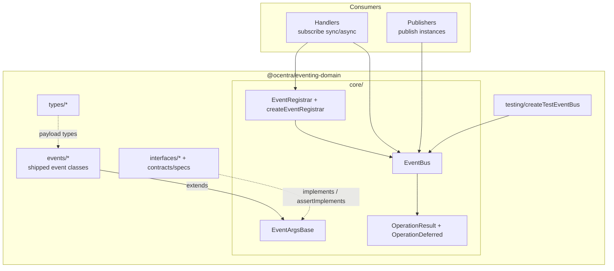

# @ocentra/eventing-domain Architecture

`@ocentra/eventing-domain` provides the shared **eventing runtime** and the shipped **event contract classes** used across the app.

## Owns

- EventBus runtime (subscribe/publish + async subscribers + queueing/retry + TTL)
- EventRegistrar and `createEventRegistrar`
- Core types (`EventArgsBase`, `OperationResult`, `OperationDeferred`)
- `interfaces/*` and `contracts/specs` (shape checks via `@ocentra/boundary-domain`)
- Supporting payload types under `types/*`
- Shipped event contract classes under `src/events/*` (each declares a canonical `static readonly eventType`)
- `testing/createTestEventBus` for an isolated `EventBus` in tests

## Design



Routing uses the **static `eventType` string** on each event class (`EventBus` keys subscribers by that string). Event instances are `EventArgsBase` subclasses; `publish` wraps outcomes in `OperationResult` and may queue or drop work per `EventBus` options.

## Dependencies (runtime)

```mermaid
flowchart LR
  ED[@ocentra/eventing-domain] --> BD[@ocentra/boundary-domain]
  ED --> LG[@ocentra/logging-domain]
```

## Boundary Rules

- Each shipped event class must declare `static readonly eventType`. **Collisions** (two classes reusing the same string) would share one subscription bucket; keep `eventType` values **distinct** across the app’s event taxonomy.
- Business logic and side effects live in consumer handlers; this package owns execution semantics (queueing, retry, TTL) and the shared contract types.
