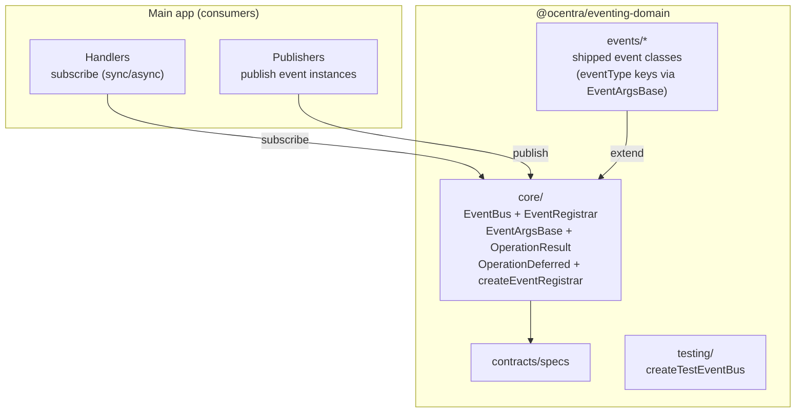

# @ocentra/eventing-domain

Single source of truth for the project’s **eventing contracts and execution semantics**.
This package provides the event runtime (EventBus/EventRegistrar/OperationResult) and the shipped event classes under `src/events/*` (each declares a canonical `static readonly eventType`).
Handlers that react to those events live in consumers that subscribe to the bus.

---

## What it does

This package provides the **eventing infrastructure**:

- **EventBus** – central pub/sub; subscribe, publish, and optionally await async subscribers (with queueing/retry + TTL).
- **EventRegistrar** – register handlers and resolve events by type.
- **EventArgsBase** – base class for event payloads (IDs, timestamps).
- **OperationResult / OperationDeferred** – async result and deferred completion for handlers.
- **Interfaces** – IEventArgs, IEventBus, IEventHandler, IEventRegistrar, IOperationResult.
- **Testing** – createTestEventBus for unit/integration tests.

Consumers **import the shared event classes** they need and subscribe handlers (sync or async) that react to them.

---

## Why it exists

The main app had a large eventing layer (~4,500 lines) in `src/lib/eventing/`. That code is reusable infrastructure, not app-specific UI or business rules. Putting it in a domain package:

- **Keeps the app focused** on UI/UX and game logic; eventing is a shared capability.
- Avoids circular deps by keeping event contracts inside the domain and depending only on shared types.
- **Makes testing and reuse clear** – the same EventBus/Registrar can be used by app, tests, or future runtimes that adopt it.
- **Single place to evolve** – changes to pub/sub execution semantics and eventType contracts happen in one package.

Eventing-domain exists so that both **execution semantics** (EventBus/EventRegistrar) and **shared event contracts** (events/* and their `eventType` keys) are explicit and maintained in one place.

---

## What it solves

- Eventing logic mixed with app code: eventing-domain owns the EventBus/EventRegistrar runtime; consumers subscribe handlers and publish event instances.
- Event contracts scattered or duplicated: eventing-domain ships shared event classes under `src/events/*` with stable `eventType` keys.
- Duplicate or divergent EventBus/Registrar logic: one implementation; all consumers import from eventing-domain.
- No clear place for “eventing contracts”: contract specs and `assertImplements` checks live here (and in boundary-domain).
- Tests need a controlled EventBus: createTestEventBus from `eventing-domain/testing`.

---

## How it connects to the rest of the system



- **Main app** creates handlers by subscribing to event types (sync or async) and publishes event instances.
- **eventing-domain** ships event classes under `src/events/*`; these extend `EventArgsBase` and declare a unique static `eventType`.
- `EventBus.publish()` returns `OperationResult<boolean>`: it resolves successfully even if no handlers were registered, with `value === true` only when a subscriber handled the event.
- eventing-domain depends on `@ocentra/boundary-domain` (contract assertions) and `@ocentra/logging-domain` (structured errors/stack traces).
- No barrel imports: import from specific entrypoints (e.g. `@ocentra/eventing-domain/core/EventBus`).

---

## In scope vs out of scope

In scope:

- EventBus, EventRegistrar, EventArgsBase, OperationResult, OperationDeferred
- Interfaces and contract specs for eventing
- Shipped event contracts (`events/*`) and their `eventType` keys
- createTestEventBus and testing helpers

Out of scope:

- Handler implementations and business logic → consumers (main app / feature domains)
- App wiring/lifecycle (where and when subscriptions are created/disposed) → consumers
- Logging storage implementation details → logging-domain

---

## What’s inside

- `version`: `EVENTING_DOMAIN_VERSION` – package version string.
- `core/EventBus`: central pub/sub bus.
- `core/EventRegistrar`: register and resolve handlers by event type.
- `core/EventArgsBase`: base class for event payloads.
- `core/OperationResult`: result type for handler outcomes.
- `core/OperationDeferred`: deferred completion for async handlers.
- `core/createEventRegistrar`: factory for EventRegistrar.
- `interfaces/*`: `IEventArgs`, `IEventBus`, `IEventHandler`, `IEventRegistrar`, `IOperationResult`.
- `contracts/specs`: eventing contract specs (uses boundary-domain).
- `events/*`: shipped event classes (EventArgsBase subclasses with unique `eventType`).
- `types/*`: supporting payload types used by those event classes.
- `testing/createTestEventBus`: test helper for a controlled EventBus.

No barrel imports. Import from the specific path you need.

---

## Usage

```ts
import { EventBus } from '@ocentra/eventing-domain/core/EventBus';
import { createEventRegistrar } from '@ocentra/eventing-domain/core/createEventRegistrar';
import { EventArgsBase } from '@ocentra/eventing-domain/core/EventArgsBase';
import type { OperationResult } from '@ocentra/eventing-domain/core/OperationResult';

class PingEvent extends EventArgsBase {
  static readonly eventType = 'Dev/Ping';
  readonly message: string;

  constructor(message: string) {
    super();
    this.message = message;
  }
}

const registrar = createEventRegistrar();
registrar.subscribe(PingEvent, (e) => {
  void e.message;
});

const result: OperationResult<boolean> = await EventBus.instance.publish(new PingEvent('hello'));
registrar.dispose();
```

---

## Scripts

- `npm run build`: Compile and emit `.d.ts`.
- `npm run type-check`: `tsc --noEmit`.
- `npm run lint`: ESLint + type-check (run from repo root).
- `npm run lint:fix`: ESLint with autofix.

---

## Domain dependencies and why

Eventing-domain **depends on** two other domain packages. Build/lint run `npm run build:domains` from root first so these are built via Turbo before eventing-domain.

```mermaid
flowchart LR
  Eventing[@ocentra/eventing-domain] --> Boundary[@ocentra/boundary-domain]
  Eventing --> Logging[@ocentra/logging-domain]
```

- `@ocentra/boundary-domain`: runtime contract assertions used by `EventArgsBase`, `EventRegistrar`, `OperationResult`, and `contracts/specs`.
- `@ocentra/logging-domain`: structured error logging + stack traces used by `EventBus`, `EventRegistrar`, `OperationResult`, and `OperationDeferred`.

---

## Relationship to other packages

- **boundary-domain** – Runtime contracts (Interface, Implements) used for contract assertions. Required.
- **logging-domain** – MainAppLogger + getStackTrace used for structured errors/stack traces. Required.

When adding/changing **eventing machinery** (EventBus/EventRegistrar/EventArgsBase contracts, queueing/retry semantics), do it in this package.
When adding/changing **shipped event contracts** (`events/*` and their `eventType` keys), do it in this package.
