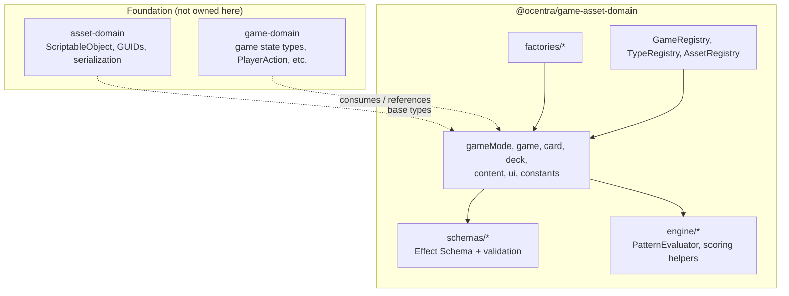
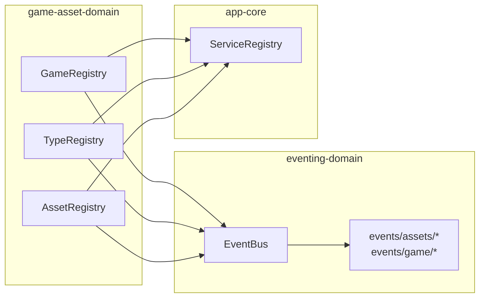

# @ocentra/game-asset-domain Architecture

This package sits **above** `@ocentra/asset-domain` and **next to** `@ocentra/game-domain`: it defines **game-mode and card-game assets** as `ScriptableObject` subclasses, validates JSON with **Effect Schema**, and exposes **registries** that connect the UI, editor, and asset pipeline through **events** and **service registration**.

## Layers

## Registries and eventing

`GameRegistry` extends `ReactBehaviour` from `@ocentra/behaviour-domain` and subscribes to `@ocentra/eventing-domain` events for game discovery, asset type info, and home/page metadata. `TypeRegistry` is a **static** registry class (not a React behaviour) that wires constructor loading and asset-type queries through `EventRegistrar` and `ServiceRegistry`. `AssetRegistry` extends `ScriptableSingleton` and implements the asset-registry handler contract via eventing; it uses **type-only** imports from `@ocentra/network-domain` and `@ocentra/boundary-domain` where resource entries cross the router boundary.

## NPM dependencies used in code

- **effect-schema**, **json5** — schema validation and JSON parsing where relevant.
- **reflect-metadata** — required by decorators used with asset-domain serialization patterns.

## Scripts vs runtime

`@ocentra/card-games` is declared so **Node scripts** under `scripts/` can read `processed-games` and run deck/card validation and reports. That dependency is **tooling**, not a claim that all runtime game code imports `card-games` directly.

## Peer dependency

**react** is a peer because `ReactBehaviour` and registry components are part of the React app wiring.

## Boundaries

- **Do not** duplicate endpoint paths or bucket names—use `@ocentra/endpoint-domain` / `@ocentra/boundary-domain` at the app or worker boundary; this package focuses on **asset shapes and registry behavior**.
- **Do not** move generic `ScriptableObject` or core serialization here—that stays in **asset-domain**.
- New game-mode or deck asset types should extend existing patterns in `gameMode/`, `schemas/`, and `constants/` so `TypeRegistry` and validation stay aligned.
