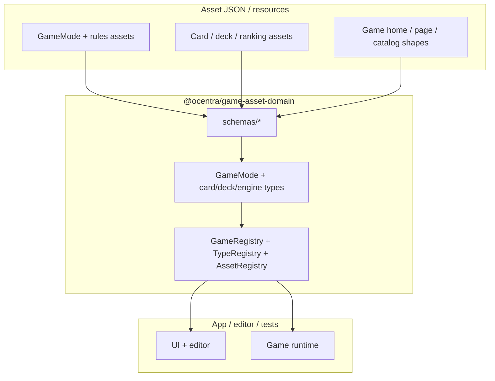
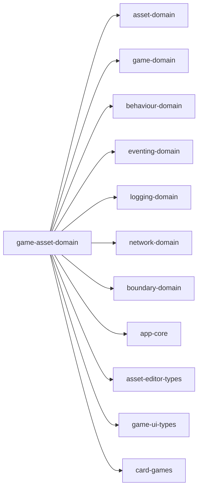

# @ocentra/game-asset-domain

## What this domain is

`@ocentra/game-asset-domain` is the **game-asset layer**: serializable game-mode and card-game asset types (built on `@ocentra/asset-domain`), Effect Schema schemas for game home/page/catalog and content slices, registries that wire the app to asset constructors and game listings, deck/session helpers, and small engine helpers (pattern evaluation, card scoring). It is consumed by the main app, asset editor flows, and validation scripts.

## Why it exists

Without a dedicated package, game-mode assets, card/deck models, and page-schema definitions drift across the app and duplicate `@ocentra/asset-domain` patterns. This package keeps **game-specific asset shapes**, **registry/event wiring**, and **validation tooling** in one place so `game-domain` can stay about runtime game logic while assets stay data-driven and consistent.

## Responsibility boundary

### In this package

- `GameMode` hierarchy (`gameMode/*`), game rules/scoring/strategy asset types (`game/*`), card/deck/ranking models (`card/*`, `deck/*`), content block types (`content/*`), UI layout asset types (`ui/*`).
- Registries and factories: `GameRegistry`, `TypeRegistry`, `AssetRegistry`, `GameModeFactory`, related asset factories.
- Effect Schema schemas under `schemas/*` (game pages, home, catalog, content shapes, asset-linked JSON).
- Engine helpers: `engine/PatternEvaluator`, `engine/CardGameScoreCalculator`.
- Constants used by those assets (`constants/*`).
- Optional asset-family modules (e.g. `mahjong/*`, `hanafuda/*`, `domino/*`, `pieces/*`) where the repo routes those assets through this layer.

### Out of scope

- Generic asset infrastructure (GUIDs, `ScriptableObject`, core serialization) → `@ocentra/asset-domain`.
- Core game state mechanics and `PlayerAction` semantics → `@ocentra/game-domain`.
- HTTP paths and API contracts → `@ocentra/endpoint-domain`.
- Publishing asset events only: contracts live in `@ocentra/eventing-domain`; this package **subscribes** and implements handlers where needed.

## What code is inside (practical map)

- `gameRegistry/` — `GameRegistry` (`ReactBehaviour`): game mode entries, home/page resolution, event-driven cache and asset queries.
- `TypeRegistry.ts` — static `TypeRegistry` (configure `assetTypeMap` before use): resolves constructors and `AssetTypeInfo`, subscribes via `EventRegistrar`, registers with `ServiceRegistry`, bridges `@ocentra/asset-domain` `AssetTypeRegistry` with app config and runtime validation registration.
- `assetRegistry/` — `AssetRegistry`: dirty/metadata/sync and resource entry flows via eventing; uses network/boundary types where asset transport is involved.
- `gameMode/` — abstract `GameMode`, `BettingGameMode`, `TurnBasedGameMode`, `CardGameMode`, `GameRulesContainer`.
- `game/` — `GameInfo`, `GameRules`, card rules, poker-style rule classes, scoring, strategy assets.
- `card/`, `deck/` — `Card`, `Deck`, rankings, `DeckManager`, `GameSessionDeckManager`.
- `content/`, `ui/` — serializable content blocks and layout types for game pages.
- `schemas/` — Effect Schema (and related) schemas for JSON assets and validation.
- `ai/` — AI model list assets and defaults.
- `engine/` — scoring/pattern evaluation helpers for card games.
- `factories/` — `GameModeFactory`, `GameModeAssetFactory`, `AIModelListAssetFactory`.
- `events/`, `types/` — synthesis helpers where the package exposes event-related types.
- `scripts/` — deck/card validation, sync with `card-games` data, coverage reports (see `package.json` scripts).

## How consumers use it

Import **specific entrypoints** (no barrel). Examples:

```ts
import { GameMode } from '@ocentra/game-asset-domain/gameMode/core/GameMode';
import { GameRegistry } from '@ocentra/game-asset-domain/gameRegistry/GameRegistry';
import { TypeRegistry } from '@ocentra/game-asset-domain/TypeRegistry';
import { baseGameSchema } from '@ocentra/game-asset-domain/schemas/base-game-schema';
```

`GameRegistry` and `TypeRegistry` register with `@ocentra/app-core/ServiceRegistry` where applicable. `AssetRegistry` is a `ScriptableSingleton` handler for asset pipeline events. All three integrate with `@ocentra/eventing-domain` for asset and game discovery.

## Runtime flow (high level)



## Package dependencies

`package.json` depends on:

- **Domains:** `@ocentra/asset-domain`, `@ocentra/game-domain`, `@ocentra/behaviour-domain`, `@ocentra/eventing-domain`, `@ocentra/logging-domain`, `@ocentra/network-domain`, `@ocentra/boundary-domain`
- **Other workspace packages:** `@ocentra/app-core` (service registry, paths), `@ocentra/asset-editor-types`, `@ocentra/game-ui-types`, `@ocentra/card-games` (validation/sync scripts and processed game data paths)

Peer: `react` (for `ReactBehaviour`-based registries).



**Note:** `@ocentra/card-games` is primarily used by **scripts** (validation, sync, coverage reports), not as a runtime import graph for the whole `src/` tree.

## Scripts

See `package.json` for the full list. Common groups:

- `validate-*` — assets, decks, cards, rankings, deck semantics, per-family deck validators.
- `sync-card-game-assets`, `fill-normaldeck-image-hashes` — data maintenance.
- `report-*` — coverage and duplication reports.

## Deep docs

- [ARCHITECTURE.md](./ARCHITECTURE.md) — structure, boundaries, and diagrams.
