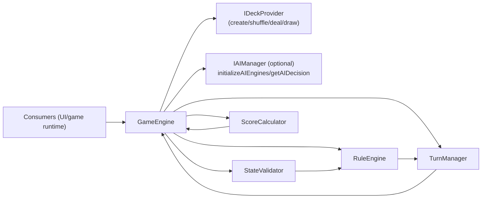

# @ocentra/game-domain Architecture

This domain defines the **shared gameplay model**:

- canonical engine orchestration (`GameEngine`)
- deterministic rules/state transitions (`RuleEngine`, `TurnManager`)
- state/action validation (`StateValidator`)
- scoring (`ScoreCalculator`)
- shared gameplay state/action types (`types/game.ts`)
- deck compatibility + default deck provider (`deck/*`)

## Owns

- Engine modules (`engine/GameEngine`, `engine/logic/*`)
- Shared gameplay contracts (`types/game.ts`)
- Gameplay constants (`game/*`)
- Deck compatibility utilities (`deck/deckCompatibility.ts`, `deckFamilies.ts`, `deckTypes.ts`)
- Integration contracts (`interfaces/IDeckProvider`, `interfaces/IAIManager`)
- Default implementation (`deck/DefaultDeckProvider`)

## Runtime diagram

## Boundary Rules

- `GameEngine` owns orchestration, but **validation and legality** are enforced inside `StateValidator` and `RuleEngine`.
- `TurnManager` is the single place where `PlayerAction` is converted into `GameState` updates.
- `ScoreCalculator` is only invoked during phase transitions into scoring (and then end-game winner determination).
- `IDeckProvider` and `IAIManager` are dependency-injection points; this package defines contracts, while consumers supply implementations.

## Notes on “deck compatibility”

- `deckCompatibility.ts` and the `deckFamilies`/`deckTypes` constants are primarily for validating and selecting decks (deck triple = `deckType` + `suitSet` + `rankSet`).
- The engine runtime itself relies on `IDeckProvider` to supply actual cards for play.
