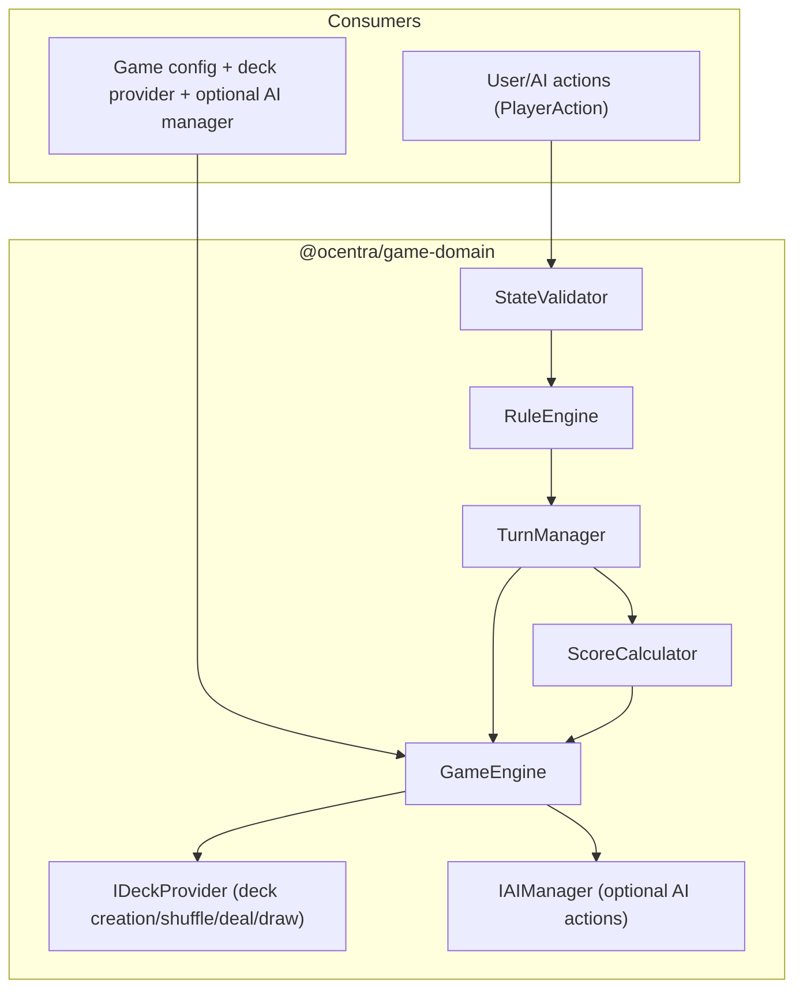

# @ocentra/game-domain

## What this domain is

`@ocentra/game-domain` is the shared gameplay logic layer: deterministic engine orchestration, shared game/deck constants, deck compatibility utilities, and the canonical gameplay state/action contracts (`types/game.ts`) used by the runtime and surrounding packages.

## What it contains (practical map)

- `engine/` — `GameEngine` orchestration plus engine logic components:
  - `engine/logic/RuleEngine` (action legality + next phase + end conditions)
  - `engine/logic/TurnManager` (apply `PlayerAction` → `GameState` updates)
  - `engine/logic/StateValidator` (validate state + validate incoming actions)
  - `engine/logic/ScoreCalculator` (score players + determine winners)
  - `engine/logic/HandUtility` and small helpers
- `deck/` — deck selection/compatibility and a seedable provider:
  - `deckTypes`, `deckFamilies`, `deckCompatibility`
  - `DefaultDeckProvider` + draw/card helper modules
- `game/` — exported gameplay constants (actions/config/turn order/visibility/scoring/etc.) under `src/game/*`
- `types/game.ts` — shared runtime types:
  - `Suit`, `Card`, `GamePhase`, `Player`, `GameState`
  - `PlayerActionType` and `PlayerAction`
  - `AIPersonality`
- `interfaces/` — integration contracts:
  - `IDeckProvider` (how decks are created/shuffled/dealt/drawn)
  - `IAIManager` (how AI produces `PlayerAction`s; optional)

## Responsibility boundary

In this package:

- Game semantics: state transitions, validation, and scoring.
- Deck compatibility helpers and default deck provider logic.
- Shared gameplay contracts (types/constants).

Out of scope:

- UI, persistence/storage, HTTP/WebSocket routes.
- Asset definitions (serialization/pipelines) — those live in `@ocentra/asset-domain` / `@ocentra/game-asset-domain`.
- Implementations of AI engines and deck sourcing — those are provided via `IAIManager` and `IDeckProvider`.

## Engine data flow

`GameEngine.processPlayerAction()` validates with `StateValidator`, checks action legality with `RuleEngine`, applies the state update with `TurnManager`, and transitions phases (including scoring/winner calculation via `ScoreCalculator`).

## Deck compatibility and provider integration

`deckCompatibility.ts` provides the canonical “deck triple” validation (`deckType`, `suitSet`, `rankSet`). The runtime engine uses `IDeckProvider` to create/shuffle/deal/draw cards; `DefaultDeckProvider` is a built-in implementation.

## Scripts

- `npm run build`
- `npm run type-check`
- `npm run lint`
- `npm run test`
