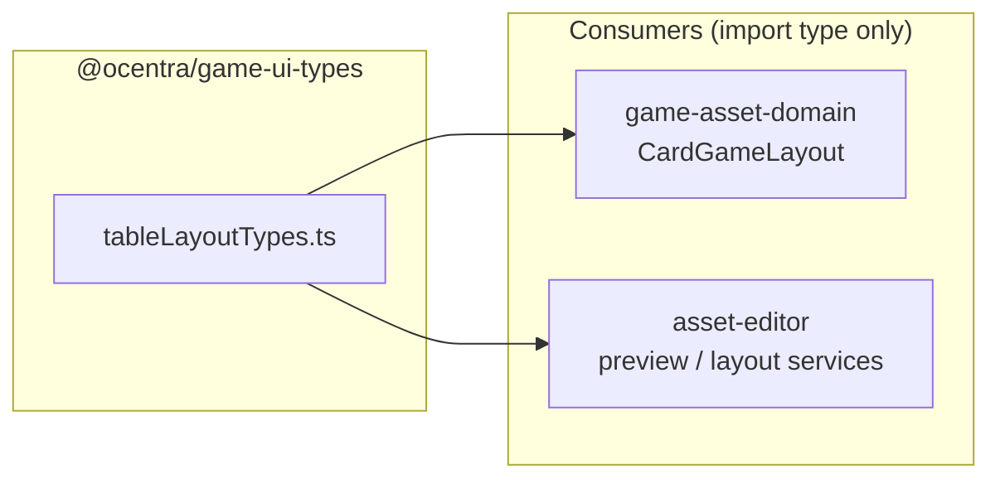
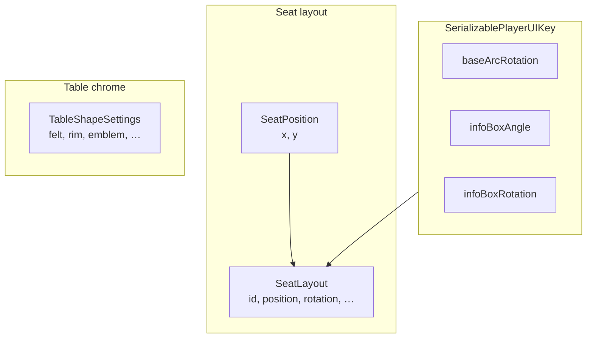

# game-ui-types — architecture

## Role

`@ocentra/game-ui-types` is a **leaf** package: one implementation file
(`src/tableLayoutTypes.ts`) with **no** runtime dependencies and **no** imports
from other `@ocentra/*` packages. It exists so layout asset definitions and UI
editors agree on the same shape for seats and table chrome without pulling in
React or game engine code.

## Module layout

## Type grouping

`SeatLayout.playerOverrides` maps `SerializablePlayerUIKey` to numeric
overrides. `TableShapeSettings` is a flat bag of optional visual parameters
(dimensions, felt, rim, emblem, glow).

## Boundaries

- **Stable contracts:** Changing field names or meaning requires coordinated
  updates in `game-asset-domain` layout assets and `asset-editor` previews.
- **No logic:** Validation, defaults, and serialization belong in consumers;
  this package only types.
