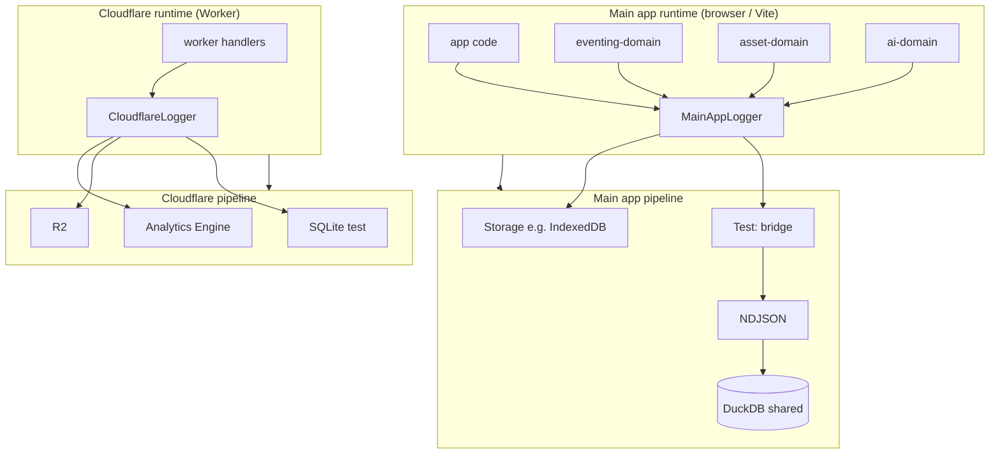
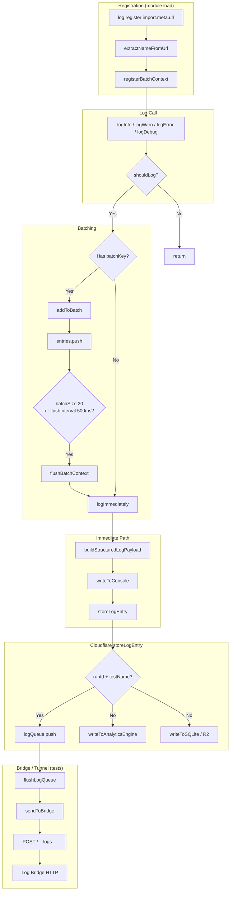
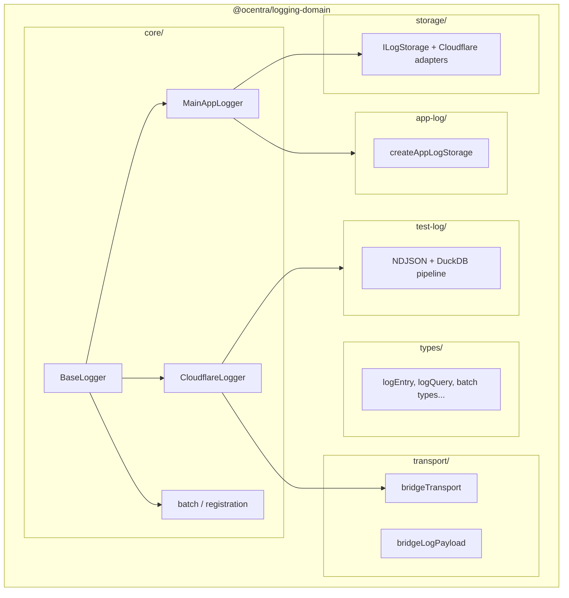
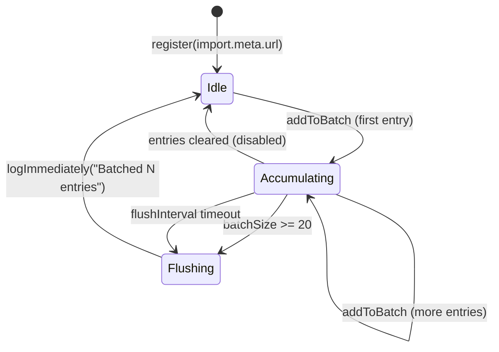
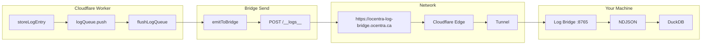

# Logging Domain Architecture

Package overview and scripts: [README.md](./README.md).

## Overview

The `@ocentra/logging-domain` package contains **all logging functionality** in a self-contained domain. This includes:

- ✅ **Types** - All logging types, interfaces, enums
- ✅ **Core Logic** - Base logger, stack parsing, batch management
- ✅ **Concrete Implementations** - MainAppLogger, CloudflareLogger
- ✅ **Adapters** - Environment-specific adapters that wrap external dependencies

## Runtime Model: Single Logger vs Separate Infra

**Main app** (browser / Vite) and all packages it imports (eventing-domain, asset-domain, ai-domain, etc.) run in the **same process**. They are separation of concern, not separate infra. So they share **one logger**: **MainAppLogger**. There is no "EventingLogger" or "AssetLogger" — those domains call `MainAppLogger` like the rest of the app.

**Cloudflare** (Workers) is **different infra**: different runtime, bindings, and deployment. It uses **CloudflareLogger** and its own pipeline (Analytics Engine, R2, etc.).

Logs are **queried by source** (e.g. `Browser:Eventing`, `Browser:Assets`, `Browser:GameEngine`). One pipeline, one store; filter by `source` in NDJSON/DuckDB to get "event" vs "assets" vs "ai" logs.



| Runtime        | Logger            | Pipeline / store                          | Query by                    |
|----------------|-------------------|-------------------------------------------|-----------------------------|
| Main app       | MainAppLogger     | IndexedDB → (test) bridge → NDJSON → DuckDB | `source` (e.g. Browser:Eventing) |
| Cloudflare     | CloudflareLogger  | Analytics Engine, R2, SQLite              | Scope `cloudflare`, runId, testName |

Domains used by the main app (eventing, asset, ai) do **not** get their own logger implementation; they use MainAppLogger so all browser logs stay in one pipeline and one DuckDB for querying.

## Flow: How Logging Works



## Package Structure



```text
packages/logging-domain/
├── src/
│   ├── types/                 # LogEntry, LogQuery, batch types, etc.
│   ├── core/                  # BaseLogger, MainAppLogger, CloudflareLogger, batching
│   │   ├── baseLogger.ts
│   │   ├── mainAppLogger.ts
│   │   ├── cloudflareLogger.ts
│   │   ├── assetEditorLogger.ts
│   │   ├── batchManager.ts, registrationManager.ts, …
│   │   └── adapters/
│   │       ├── mainAppPathResolver.ts
│   │       ├── cloudflarePathResolver.ts
│   │       ├── cloudflareRequestContextProvider.ts
│   │       └── cloudflareLogDecisionProvider.ts
│   ├── storage/               # ILogStorage; Cloudflare adapter types
│   │   ├── storageInterface.ts
│   │   ├── cloudflareStorageProvider.ts
│   │   └── adapters/cloudflareStorage.ts
│   ├── transport/           # Bridge payload + send helpers
│   ├── test-log/            # NDJSON, DuckDB test store, bridge convert, manifests
│   └── app-log/             # Optional app-scoped NDJSON + DuckDB (createAppLogStorage)
```

## Architecture Pattern: Dependency Injection via Adapters

The domain uses **adapters** to inject environment-specific functionality:

### Main app adapter wiring

```typescript
// In main app - create adapters with environment-specific functions
import { MainAppLogger } from '@ocentra/logging-domain/core/mainAppLogger';
import { MainAppPathResolver } from '@ocentra/logging-domain/core/adapters/mainAppPathResolver';
import { LogConsumer } from '@ocentra/logging-domain/transport/bridgeLogPayload';
import { getFilePathFromUrl, getSourceFromFilePath } from '@/lib/core/path';

// Create path resolver adapter
const pathResolver = new MainAppPathResolver({
  getFilePathFromUrl,
  getSourceFromFilePath,
});

// Create EventBus-backed storage that batches and sends via SaveLogsEvent
// (see src/lib/logging/init.ts for full implementation)
MainAppLogger.initLogger(eventBusStorage, pathResolver, {
  bridgeConsumer: LogConsumer.Main,
});
```

### Cloudflare adapter wiring

```typescript
// In cloudflare - create adapters with environment-specific functions
import { CloudflareLogger } from '@ocentra/logging-domain/core/cloudflareLogger';
import { CloudflarePathResolver } from '@ocentra/logging-domain/core/adapters/cloudflarePathResolver';
import { CloudflareRequestContextProvider } from '@ocentra/logging-domain/core/adapters/cloudflareRequestContextProvider';
import { CloudflareLogDecisionProvider } from '@ocentra/logging-domain/core/adapters/cloudflareLogDecisionProvider';
import { CloudflareStorage } from '@ocentra/logging-domain/storage/adapters/cloudflareStorage';
import { getCurrentContext } from '@/logging/request-context';
import { shouldLog, shouldLogToConsole, shouldStoreLog, isDevOrTestEnvironment } from '@/logging/log-config';

// Create adapters
const pathResolver = new CloudflarePathResolver({
  getFilePathFromUrl: (url) => { /* cloudflare implementation */ },
});

const requestContextProvider = new CloudflareRequestContextProvider({
  getCurrentContext,
});

const logDecisionProvider = new CloudflareLogDecisionProvider({
  shouldLog,
  shouldLogToConsole,
  shouldStoreLog,
  isDevOrTestEnvironment,
});

const cloudflareStorage = new CloudflareStorage({
  writeToAnalyticsEngine: (entry) => { /* analytics engine write */ },
  writeToSQLite: async (entry, testName) => { /* sqlite write */ },
  flushDebugLogsToR2: async (entries, force) => { /* r2 flush */ },
  getLogs: () => { /* get logs */ },
});

// Create logger
const logger = CloudflareLogger.create(
  pathResolver,
  requestContextProvider,
  logDecisionProvider,
  cloudflareStorage,
  config
);
```

## What's in the Domain vs What's in Apps

### ✅ In Domain (Everything Logging-Related)

- All types and interfaces
- BaseLogger (abstract base class)
- MainAppLogger (concrete implementation)
- CloudflareLogger (concrete implementation)
- Adapter classes (wrappers for environment-specific code)
- Core utilities (stack parsing, batch management, etc.)

### 🔄 In Apps (Environment-Specific Bindings)

- Path resolution functions (`getFilePathFromUrl`, `getSourceFromFilePath`)
- Storage implementations (`ViteLogStorage`, `AnalyticsLogStorage`)
- Cloudflare bindings (Analytics Engine, R2, SQLite functions)
- Request context functions (`getCurrentContext`)
- Log decision functions (`shouldLog`, `shouldLogToConsole`, etc.)

**These are passed to domain adapters at initialization time.**

## Status: domain done, cloudflare in use, main/solana not yet

| Area | Status |
|------|--------|
| **Domain package** | Done. Types, core loggers, adapters, transport, test-log (bridge, NDJSON, DuckDB, scopes, scripts) all live here. |
| **Test-log infra** | Done. Log bridge, per-scope DB/manifest, rebuild/ingest/query scripts, summary reporter; cloudflare tests use it. |
| **Cloudflare** | In use. Infra/cloudflare uses domain loggers, bridge, and scope `cloudflare` for test logs. |
| **Main app** | In use. App code imports `MainAppLogger` and `getStackTrace` from this package (e.g. `mainLoggingBootstrap`, adapters). |
| **Solana** | Not yet. Domain is ready; solana module has not been switched to domain logging or scope `solana` for test logs. |

Applying to other modules (when you do it): main app already uses `MainAppLogger` from this package; wire solana to domain and use scope `solana` for test logs if needed. No change required inside the domain package for main app wiring.

## Key Design Decisions

### Why Adapters?

- **Separation of Concerns**: Domain doesn't depend on environment-specific code
- **Testability**: Easy to mock adapters in tests
- **Flexibility**: Can swap implementations without changing domain code
- **Gradual Migration**: Can migrate piece by piece

### Why Concrete Implementations in Domain?

- **Self-Contained**: Domain has everything needed for logging
- **No Duplication**: Single source of truth for logger logic
- **Easy Migration**: Apps just swap imports, logic stays the same

### Why One Logger for Main App (No per-Domain Logger)?

- **Same process**: eventing-domain, asset-domain, ai-domain, and app code run in the same browser/Vite process. They are package boundaries for separation of concern, not separate infra.
- **Single pipeline**: One MainAppLogger → one store → one NDJSON/DuckDB. Query by `source` (e.g. `Browser:Eventing`, `Browser:Assets`) to get per-domain logs. No need for a separate "EventingLogger" or separate infra.
- **Cloudflare is different**: Worker runtime is separate infra, so it has CloudflareLogger and its own pipeline. See [Runtime model: Single logger vs separate infra](#runtime-model-single-logger-vs-separate-infra).

### Why Not Move Storage Implementations Yet?

- **Dependencies**: Storage implementations have heavy dependencies (better-sqlite3, Cloudflare bindings)
- **Gradual Migration**: Can migrate adapters first, storage later
- **Flexibility**: Apps can still use existing storage implementations during transition

## Usage Examples

### Main app usage snippet

```typescript
import { MainAppLogger } from '@ocentra/logging-domain/core/mainAppLogger';
import { getStackTrace } from '@ocentra/logging-domain/core/stackTrace';

// After initLogging() has been called:
MainAppLogger.instance.logInfo('GAME_ENGINE', 'Game started', getStackTrace(), { gameId: '123' });
```

### Cloudflare usage snippet

```typescript
import { CloudflareLogger } from '@ocentra/logging-domain/core/cloudflareLogger';
import { CloudflarePathResolver } from '@ocentra/logging-domain/core/adapters/cloudflarePathResolver';
import { CloudflareRequestContextProvider } from '@ocentra/logging-domain/core/adapters/cloudflareRequestContextProvider';
import { CloudflareLogDecisionProvider } from '@ocentra/logging-domain/core/adapters/cloudflareLogDecisionProvider';
import { CloudflareStorage } from '@ocentra/logging-domain/storage/adapters/cloudflareStorage';

// Initialize with environment-specific functions
const logger = CloudflareLogger.create(
  pathResolver,
  requestContextProvider,
  logDecisionProvider,
  cloudflareStorage
);

logger.logInfo('Badges', 'Claim started', { userId: '123' });
```

## Batch Lifecycle



## Test Log Infrastructure (Tunnel + Bridge)

### The Problem

Cloudflare Workers run in **isolated environments** (Miniflare threads mode). When a Worker calls `fetch('http://localhost:8765')`, that `localhost` is the Worker's isolated environment — **NOT your machine**.

```text
Worker's localhost ≠ Your machine's localhost
```

### The Solution

A **Cloudflare Tunnel** provides a public HTTPS URL that routes through Cloudflare's edge network to your local machine.



### Components

| Component      | Location                                         | Purpose                                   |
| -------------- | ------------------------------------------------ | ----------------------------------------- |
| Log Bridge     | `packages/logging-domain/scripts/log-bridge.ts`  | HTTP server receiving logs, writes NDJSON |
| Tunnel Script  | `scripts/start-tunnel-and-bridge.ts`             | Starts bridge + cloudflared tunnel        |
| VS Code Task   | `.vscode/tasks.json`                             | Auto-starts on folder open                |

### Endpoints (Log Bridge)

- `GET /__health__` — Health check
- `POST /__logs__` — Accept logs: `[{ testName, runId, log, consumer? }]`
- `POST /__flush__` — Flush to NDJSON: `{ runId }`

### Prerequisites

- **Required:** Node.js (bridge runs without tunnel for local-only testing)
- **For tunnel:** `cloudflared` CLI installed and configured

See [TUNNEL_GUIDE.md](./TUNNEL_GUIDE.md) for full setup instructions.

### Scopes (domains) – per-domain DB and manifest

Test-log storage is **scope-aware**. Each scope (domain) has its own DuckDB file and ingest manifest so cloudflare, main app, and solana do not share one DB.

| Scope     | DB file                     | Manifest file                  |
| --------- | --------------------------- | ------------------------------ |
| default   | `db/default-log.duckdb`     | `db/ingest-manifest-default.json` |
| cloudflare| `db/cloudflare-log.duckdb`  | `db/ingest-manifest-cloudflare.json` |
| main      | `db/main-log.duckdb`        | `db/ingest-manifest-main.json` |
| solana    | `db/solana-log.duckdb`      | `db/ingest-manifest-solana.json` |

- **Env:** Set `LOG_DB_DOMAIN=cloudflare` (or `main`, `solana`) so all scripts and the summary reporter use that scope. Unset → scope `default`.
- **CLI:** Scripts accept `--domain=cloudflare` (or `main`, `solana`, `default`). Overrides env when present.

**Scripts and scope:**

| Script | Scope source | Effect |
|--------|--------------|--------|
| `query-test-logs.ts` | `--domain=` or `LOG_DB_DOMAIN` | Opens `{domain}-log.duckdb`, lazy-ingests into that DB and `ingest-manifest-{domain}.json`. |
| `rebuild-db-from-ndjson.ts` | `--domain=` (default `cloudflare`) | Full rebuild or incremental ingest into `{domain}-log.duckdb` and manifest. |
| `ensure-db.ts` | `--domain=` or `LOG_DB_DOMAIN` | Creates `{domain}-log.duckdb` if missing. |
| `db-inspect.ts` | `--domain=` or `LOG_DB_DOMAIN` | Opens and inspects `{domain}-log.duckdb`. |
| `duckDbQueue` (lazy ingest) | `LOG_DB_DOMAIN` | Uses same scope for DB path and manifest when ingesting. |

Infra/cloudflare sets `LOG_DB_DOMAIN=cloudflare` when running tests and passes `--domain=cloudflare` to rebuild/ingest so cloudflare tests always use `cloudflare-log.duckdb`.

### DuckDB test log store – concurrency and writes

- **Single writer:** Only one process should write to the same DuckDB file. The log bridge is the writer; it serializes flushes with an internal `ingestLock` so only one DuckDB ingest runs at a time within that process. If another terminal or IDE runs tests, they hit the same bridge, flushes stay serialized. Do not run two bridges (or any other writer) against the same `{domain}-log.duckdb` — DuckDB does not coordinate across processes and you can get "file in use" or corruption.
- **Readers:** The query script (`scripts/query-test-logs.ts`) opens the DB read-only. If a flush is in progress, the file may be locked; the script retries opening the DB a few times with a short delay, so `npm run test:query` usually succeeds even when a write is happening.
- **Write speed:** Writes are batched (test_runs in one batch, test_logs in batches of 500) and the DB connection is closed as soon as ingest finishes to minimize how long the file is held.

---

## Applying to other modules (optional, when needed)

- **Main app:** Already uses `MainAppLogger` from this package; adapters and `initLogging` live in the app (`@/lib/logging/init`, path resolver, storage). Further work is app-side only (e.g. more call sites), not domain API changes.
- **Solana:** Use domain types/transport if desired; for test logs use scope `solana` and `--domain=solana` (or `LOG_DB_DOMAIN=solana`) so solana has its own `solana-log.duckdb` and manifest.
- **Storage in domain:** Moving `ViteLogStorage` / Cloudflare storage into the domain is optional and can be done later; apps can keep passing storage implementations into adapters.
