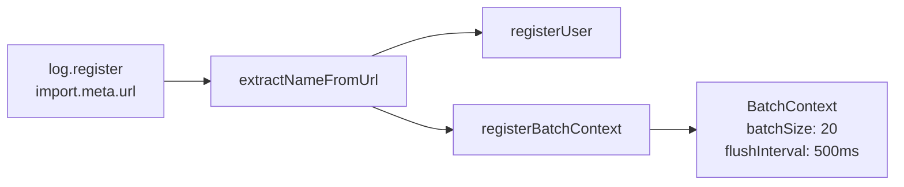
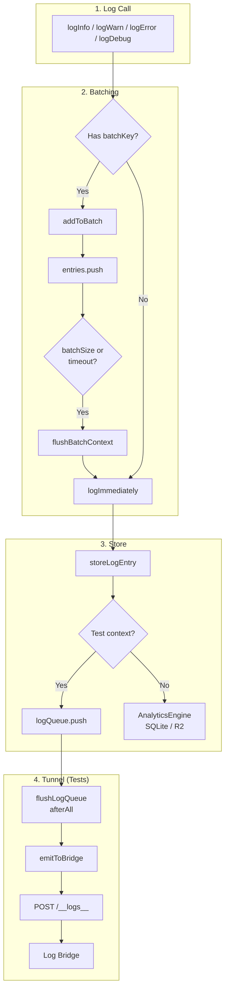

# @ocentra/logging-domain

Self-contained logging domain for Ocentra: types, core loggers, adapters, and test-log infrastructure (bridge, NDJSON, DuckDB).

## Quick commands

From repo root or `packages/logging-domain`:

| Do this | Command |
|--------|---------|
| Build | `cd packages/logging-domain && npm run build` |
| Start log bridge | `cd packages/logging-domain && npm run bridge` |
| Create DB (cloudflare) | `cd packages/logging-domain && npm run db:ensure -- --domain=cloudflare` |
| Full rebuild DB from NDJSON | `cd packages/logging-domain && npm run db:rebuild -- --domain=cloudflare` |
| Incremental ingest (no delete) | `cd packages/logging-domain && npm run db:ingest -- --domain=cloudflare` |
| Failed tests (cloudflare) | `cd packages/logging-domain && npm run test:query -- failed --domain=cloudflare` |
| Stats (cloudflare) | `cd packages/logging-domain && npm run test:query -- stats --domain=cloudflare` |
| By run ID | `cd packages/logging-domain && npm run test:query -- by-run <run-id> --domain=cloudflare` |
| Inspect DuckDB | `cd packages/logging-domain && npx tsx scripts/db-inspect.ts --domain=cloudflare` |
| Lint | `cd packages/logging-domain && npm run lint` |

From `infra/cloudflare` (run all tests then ingest):

| Do this | Command |
|--------|---------|
| Run all tests (unit + integration + e2e, pool + threads) | `cd infra/cloudflare && npm run test:helper` |
| Query failed after test:helper | `cd packages/logging-domain && npm run test:query -- failed --domain=cloudflare` |

## What to expect when you run test:helper

From `infra/cloudflare`, `npm run test:helper` runs `run-suite-helper.ts --type=all --mode=both`. You will see:

1. **Wipe** – NDJSON under the test-runner logs is wiped (fresh run).
2. **Unit** – Phase 1 (count tests from source), then each unit test file run with **pool** workers, then each with **unstable (threads)**. After unit: **DuckDB ingest** (incremental, `cloudflare-log.duckdb`).
3. **Integration** – Same pattern for integration tests; ingest again after.
4. **E2E** – Same pattern for e2e tests; ingest again after.
5. **FINAL SUMMARY (ALL)** – Totals (files, passed/failed/timeout/unstable), wall-clock time, and copy-paste **query commands** (failed per suite, by run type, by last run ID).
6. **Combined summary** – Written to `infra/cloudflare/test-runner/logs/all-test-helper-results.txt`.

After it finishes you can query from `packages/logging-domain`, e.g.:

- `npm run test:query -- failed --domain=cloudflare`
- `npm run test:query -- stats --domain=cloudflare`
- `npm run test:query -- by-run <run-id> --domain=cloudflare`

If DuckDB ingest fails (e.g. missing NDJSON dir), you'll see a short warning; tests still complete and you can run ingest manually: `npm run db:ingest -- --domain=cloudflare`.

## What’s in this package

- **Types** (`src/types/`) – Log types, interfaces, enums
- **Core** (`src/core/`) – Base logger, MainAppLogger, CloudflareLogger, AssetEditorLogger, adapters, batching
- **Storage** (`src/storage/`) – `ILogStorage` contract, Cloudflare storage adapter types
- **Transport** (`src/transport/`) – Bridge payload types and send helpers
- **Test log** (`src/test-log/`, `scripts/`) – Log bridge (HTTP server), NDJSON writer, DuckDB test store, ingest manifest, query/rebuild scripts
- **App log** (`src/app-log/`) – Optional app-scoped NDJSON + DuckDB (`createAppLogStorage`, ingest helpers) for tooling separate from Vitest test-log paths

**Runtime model:** Main app and its domains (eventing, asset, ai, etc.) use **one logger** (`MainAppLogger`) and one pipeline; Cloudflare uses `CloudflareLogger` and its own pipeline. See [ARCHITECTURE.md](./ARCHITECTURE.md#runtime-model-single-logger-vs-separate-infra).

## Storage contracts

- **ILogStorage** (`src/storage/storageInterface.ts`) – Used by **MainAppLogger** (browser and Vite dev). Contract: store logs and support **query** (queryLogs, getStats, clearLogs). Main app and Vite use one implementation (e.g. in-memory or SQLite) so the Logs UI and MCP see the same data. Same types (LogEntry, LogQuery, LogStats) and same npm package everywhere.
- **CloudflareStorageProvider** (`src/storage/cloudflareStorageProvider.ts`) – Used by **CloudflareLogger** (worker). Write-only: Analytics Engine, optional SQLite for test, R2 for debug. No query API in the domain; worker Logs API reads from Analytics Engine separately. Kept separate so worker storage matches Cloudflare bindings (Analytics Engine, R2).
- **NDJSON / DuckDB** – Used for **test-run ingestion** (ingest NDJSON from Cloudflare/Vitest runs into DuckDB for querying). Not the runtime app storage; runtime uses ILogStorage or CloudflareStorageProvider above.

## Scopes (domains)

Test-log storage is **scope-aware**. Each scope has its own DuckDB file and ingest manifest:

| Scope       | DB file                         | Manifest file                       |
| ----------- | -------------------------------- | ----------------------------------- |
| default     | `db/default-log.duckdb`          | `db/ingest-manifest-default.json`   |
| cloudflare  | `db/cloudflare-log.duckdb`       | `db/ingest-manifest-cloudflare.json`|
| main        | `db/main-log.duckdb`             | `db/ingest-manifest-main.json`      |
| solana      | `db/solana-log.duckdb`           | `db/ingest-manifest-solana.json`    |

- **Env:** `LOG_DB_DOMAIN=cloudflare` (or `main`, `solana`) → all scripts use that scope. Unset → `default`.
- **CLI:** Scripts accept `--domain=cloudflare` (or `main`, `solana`, `default`). Overrides env when set.

## Scripts

Run from `packages/logging-domain` unless noted.

| Command | Purpose |
| ------- | ------- |
| `npm run build` | Compile TypeScript (`tsc && tsc-alias`) |
| `npm run bridge` | Start log bridge HTTP server (receives logs, writes NDJSON) |
| `npm run db:ensure` | Create DuckDB if missing (`--domain=` or `LOG_DB_DOMAIN`) |
| `npm run db:rebuild` | Full rebuild: delete DB, ingest all NDJSON (default `--domain=cloudflare`) |
| `npm run db:ingest` | Incremental ingest: no delete, only new/changed NDJSON |
| `npm run test:query` | Query test runs/logs (`failed`, `stats`, `by-run`, etc.; `--domain=` supported) |
| `npm run lint` | ESLint on `src/**/*.ts` and `scripts/**/*.ts` |

Examples:

```bash
# Cloudflare scope (default for rebuild/ingest)
npm run db:rebuild
npm run db:ingest
npm run test:query -- failed --domain=cloudflare

# Default scope
npm run db:ensure
npm run test:query -- stats

# Set scope via env
$env:LOG_DB_DOMAIN = "cloudflare"; npm run test:query -- failed
```

## Quick start

1. **Build:** `npm run build`
2. **Log bridge (for tests):** `npm run bridge` — then run tests; logs go to NDJSON under `logs/`.
3. **Ingest into DuckDB:** `npm run db:ingest` (incremental) or `npm run db:rebuild` (full). For cloudflare, use `--domain=cloudflare` or set `LOG_DB_DOMAIN=cloudflare`.
4. **Query:** `npm run test:query -- failed --domain=cloudflare` (or omit `--domain` for default scope).

## How It Works

### Registration

Call `log.register(import.meta.url)` at module load. The logger derives a batch key from the URL (e.g. `"Ai"`, `"Router"`) and creates a `BatchContext` for batching.



### Log Flow (Call → Batch → Store → Bridge)



## Docs

- [ARCHITECTURE.md](./ARCHITECTURE.md) — Flow diagrams, domain layout, adapters, tunnel/bridge, scopes, DuckDB concurrency
- [docs/TEST-HELPER-COMMANDS.md](./docs/TEST-HELPER-COMMANDS.md) — Cloudflare helper scripts, query commands, NDJSON layout
- [TUNNEL_GUIDE.md](./TUNNEL_GUIDE.md) — Tunnel + log bridge setup
- [docs/ARCHITECTURE.md](./docs/ARCHITECTURE.md) — Short index (links to the documents above)
