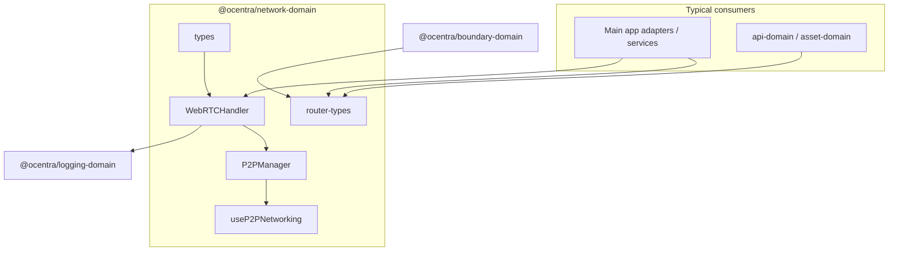
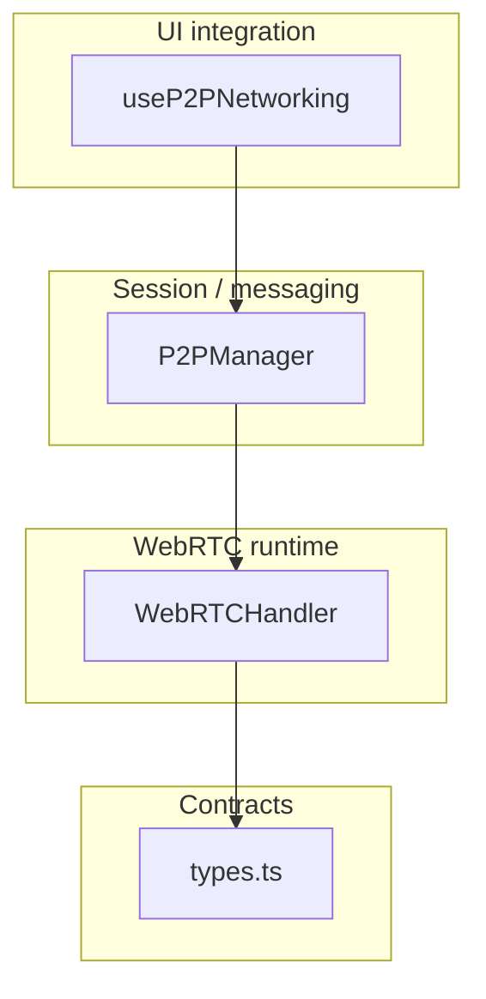
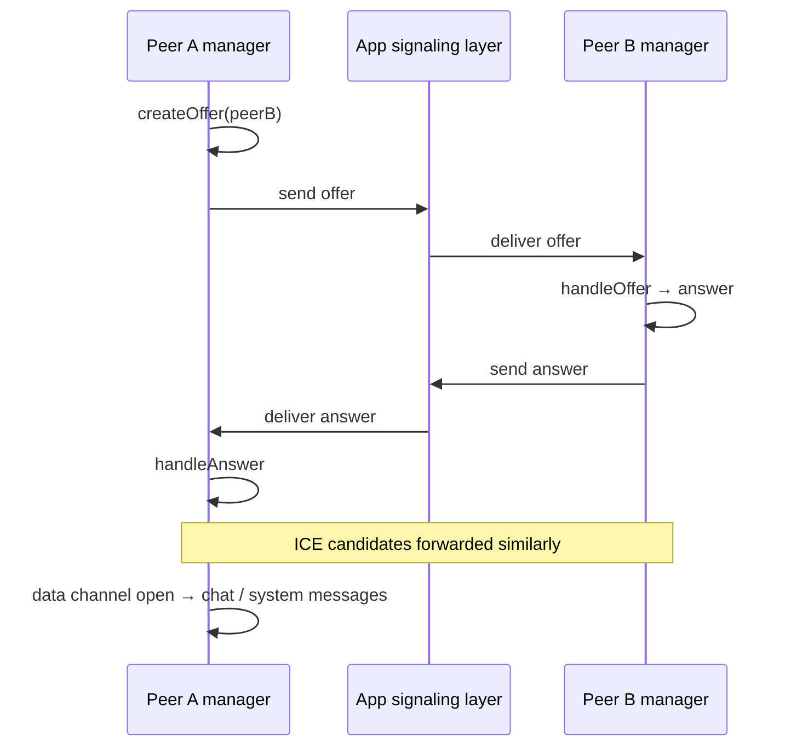

# network-domain — architecture

## Role

`@ocentra/network-domain` is two concerns in one package:

1. **P2P / WebRTC** — `WebRTCHandler` (low-level), `P2PManager` (mid-level), `useP2PNetworking` (React).
2. **Router contracts** — `router-types` re-exports boundary-domain types so UI, api-domain, and asset pipelines agree on `ResourceRequest` and scan shapes without importing boundary-domain everywhere.

## Layering

- **`types`** — Serializable-friendly message and signaling shapes; `ConnectionStatus` enum-style object.
- **`WebRTCHandler`** — Owns a `Map` of `PeerConnection`, wires ICE, tracks, optional data channel, parses JSON `PeerMessage`, responds to `ping` with `pong`.
- **`P2PManager`** — Composes `WebRTCHandler`, tracks per-peer status, implements offer/answer/ICE flows for new peers, chat/system send helpers, forwards callbacks.
- **`useP2PNetworking`** — Single `P2PManager` per hook instance (effect keyed on `localPeerId` + `rtcConfiguration`), exposes imperative methods via refs and React state for peers/messages/streams/errors.

## Signaling and media (outside this package)

The domain **does not** implement signaling transport (WebSocket, HTTP, etc.). Callers exchange `RTCSessionDescriptionInit` and `RTCIceCandidateInit` (e.g. your `SignalingMessage` shape in `types`) however the app designs it, then call `P2PManager` / `WebRTCHandler` methods to apply them.

## Router types (`router-types`)

Single import surface for types that **originate** in `@ocentra/boundary-domain`. Keeps router and asset code aligned without duplicating type definitions in the app.

## Tests

- **`tests/`** — Unit tests with mocked `RTCPeerConnection` / `RTCDataChannel` (`WebRTCHandler`, `P2PManager`).
- **`e2e/`** — Playwright specs (see `e2e/*.spec.ts`) for browser-level behavior where applicable.

## Boundaries

- **Logging:** Only `WebRTCHandler` depends on `@ocentra/logging-domain` for error reporting.
- **React:** Only the hook module imports React; non-React consumers can use `WebRTCHandler` / `P2PManager` directly.
- **No endpoint strings:** Network I/O for REST/worker routes belongs to `@ocentra/endpoint-domain`; this package does not define API paths.
