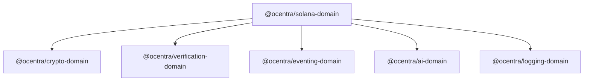
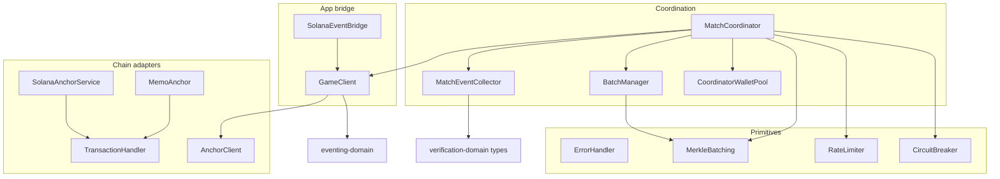
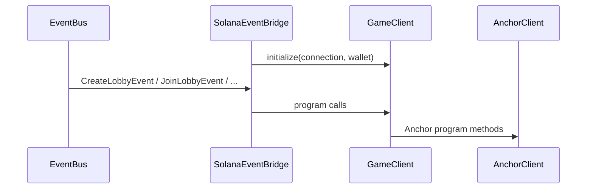

# solana-domain — architecture

## Role

`@ocentra/solana-domain` is the **TypeScript client layer** for Solana: it wraps `web3.js` (and Anchor when available), adds **reliability** (rate limit, circuit breaker, structured errors), **verification-oriented** match recording (crypto + verification-domain), and **UI integration** via eventing-domain. It does **not** define HTTP routes or deploy programs.

## Workspace dependency graph

| Dependency | Used for |
|------------|----------|
| crypto-domain | `HashService`, `SignatureService`, Merkle leaf/pair hashing |
| verification-domain | Canonical bytes, `MatchRecord` / move/signature types, serializers |
| eventing-domain | `EventBus`, lobby/game events (`GameClient`, `SolanaEventBridge`) |
| ai-domain | Match recording / AI decision capture inside `MatchCoordinator` |
| logging-domain | Structured logging on failure and major steps |

## Layering (runtime)

- **`TransactionHandler`** is shared plumbing for send/confirm; **`MemoAnchor`** / **`SolanaAnchorService`** build memo transactions; **`AnchorClient`** owns IDL/program access; **`GameClient`** encodes game-specific instruction flows.
- **`MatchCoordinator`** is the largest orchestration unit: ties `GameClient`, optional storage (`IMatchRecordStorage`), batching, wallets, rate limit, breaker, AI recorder, and verification/crypto services.

## Event-driven path (browser / app)

`SolanaEventBridge` must be **`initialize`d** with a `Connection` and Anchor `Wallet` before events mutate chain state; otherwise handlers log and return early.

## Types and injection

- **`types`** — move enums/structs shared with coordinator and client.
- **`interfaces`** — **`IMatchRecordStorage`** (e.g. R2 upload), **`IMetricsCollector`** (tx/match/storage/dispute metrics) — implemented by the host app or infra, not by this package.

## Tests

- **`tests/`** — Vitest suites: load tests, e2e integration, benchmarks (creation/move flows). Require appropriate env/RPC and optional chain access as configured in `vitest.config.ts`.

## Boundaries

- **Solana + Anchor peers** must be installed by the app; this package does not bundle validators or programs.
- **IDL** loading is environment-specific (filesystem in Node, else inject/bundle IDL for browser) — see `AnchorClient` implementation notes.
- **No raw API paths** for app HTTP — use `@ocentra/endpoint-domain` in callers; this domain speaks RPC and program instructions only.
