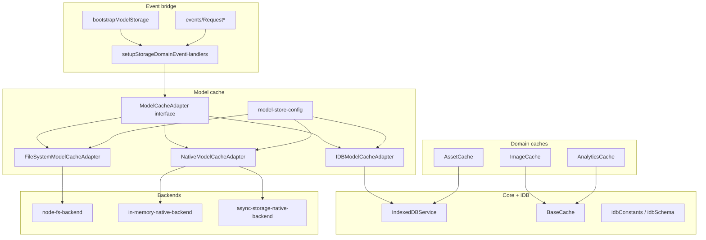
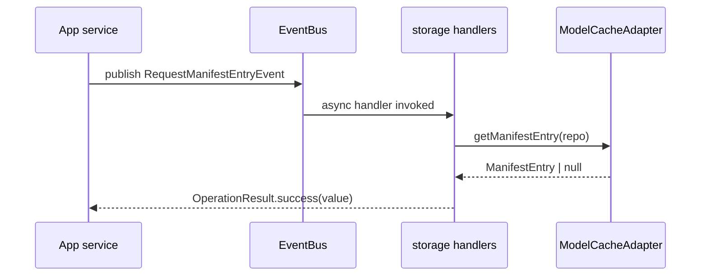

# storage-domain — architecture

## Role

`@ocentra/storage-domain` provides shared storage primitives and adapters across
browser, desktop, and native runtimes. It is the storage boundary for model files,
manifest metadata, chunked binary payloads, and inference settings.

## Package map



## Dependency graph

```mermaid
flowchart LR
  STORAGE[@ocentra/storage-domain] --> EVENTING[@ocentra/eventing-domain]
  STORAGE --> LOGGING[@ocentra/logging-domain]
```

- **eventing-domain:** request/response contracts over EventBus
  (`EventArgsBase`, `OperationDeferred`, `OperationResult`).
- **logging-domain:** cache modules use `MainAppLogger` for storage diagnostics.

## Event-driven integration

`bootstrapModelStorage` picks one `ModelCacheAdapter`:

- `config` provided -> create `IndexedDBService` + `IDBModelCacheAdapter`
- `modelCache` provided -> use injected adapter (desktop/native)

Then it calls `setupStorageDomainEventHandlers`, which subscribes handlers for
manifest/chunk/blob/settings request events and returns a teardown function.



## Integrity and chunking model

- `IDBModelCacheAdapter`, `NativeModelCacheAdapter`, and
  `FileSystemModelCacheAdapter` all implement chunk-manifest writes.
- They compute/store checksums per chunk and verify during reassembly.
- On checksum failure, they purge corrupt chunk groups best-effort and return `null`
  to trigger upstream refetch.
- `tryServeFromCache` can return full buffered responses or streaming responses for
  large assets.

## Runtime boundaries

- `node-fs-backend` has a browser stub (`node-fs-backend.browser.ts`) that throws,
  preventing accidental Node FS use in browser bundles.
- Node backend rejects path traversal and UNC paths.
- Logger wiring is runtime-configurable via `logger/runtime` (`initLogger`,
  `setLogger`, `resetLogger`), with noop default.

## Tests

The package includes adapter/backend behavior tests in `tests/` including:

- `NativeModelCacheAdapter.spec.ts`
- `node-fs-backend.spec.ts`
- `in-memory-native-backend.spec.ts`
- `persistence-smoke.spec.ts`
