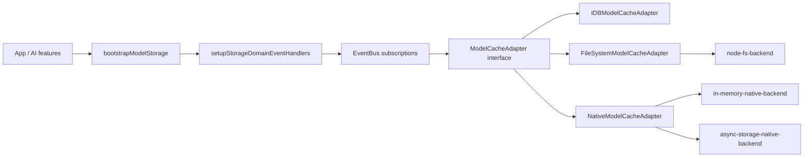

# @ocentra/storage-domain

Cross-platform storage domain for Ocentra model files and cache data.
Includes IndexedDB primitives, model-cache adapters for browser/native/filesystem,
EventBus request contracts, and bootstrap wiring.

## Scope

- **In:** IndexedDB service + base cache, model manifest/chunk/blob operations,
  cache-serving response helpers, storage event contracts, and platform backends.
- **Out:** API endpoints and business logic orchestration in app/infra layers.

## Public API (subpath exports)

Use explicit subpaths from `package.json` `exports`.

- **Core:** `core/IndexedDBService`, `core/BaseCache`
- **Model cache:** `model-cache/ModelCacheAdapter`, `model-cache/IDBModelCacheAdapter`,
  `model-cache/FileSystemModelCacheAdapter`, `model-cache/NativeModelCacheAdapter`,
  `model-cache/FileSystemBackend`, `model-cache/types`, `model-cache/model-store-config`
- **Backends:** `backends/node-fs-backend`, `backends/in-memory-native-backend`,
  `backends/async-storage-native-backend`
- **Caches:** `caches/ImageCacheService`, `caches/AssetCacheService`, `caches/AnalyticsCache`
- **Event wiring:** `setupStorageDomainEventHandlers`, `bootstrap/bootstrapModelStorage`,
  `events/*` request contracts
- **IDB helpers:** `idb/idbConstants`, `idb/idbSchema`, `idb/idbBase`
- **Logger hooks + constants:** `logger/noop`, `logger/runtime`, `types/logger`,
  `types/config`, `constants/validation`, `version`

## Runtime model

`setupStorageDomainEventHandlers` validates required adapter capabilities
(`getManifestEntry`, `addManifestEntry`, `addQuantToManifest`, `getChunkInfo`,
`saveChunkedFileSafe`, `getFromIndexedDB`, `extractDtypeFromPath`) and fail-fast
if missing.

## Data flow highlights

- **Chunked model writes:** adapters split blobs into chunks, persist a chunk-manifest,
  and mark status (`writing` -> `present`).
- **Integrity checks:** adapters store per-chunk checksums and verify on reassembly;
  checksum mismatch purges corrupt chunks and returns `null` for refetch.
- **Serve from cache:** optional `tryServeFromCache(url, modelId)` returns `Response`
  with headers and supports large streamed responses.
- **Event responses:** `events/*` use `OperationDeferred` + `OperationResult` over
  eventing-domain, avoiding direct storage coupling in callers.

## Dependencies

- **`@ocentra/eventing-domain`** — EventBus, event arg/deferred contracts.
- **`@ocentra/logging-domain`** — integrated in cache services for structured logs.

## Scripts

- `npm run build`
- `npm run type-check`
- `npm run lint`
- `npm run test`

## Related docs

- `src/model-cache/MODEL_CACHE_ADAPTER_CONTRACT.md` — required vs optional adapter methods.
- `ARCHITECTURE.md` — package structure and diagrams.
