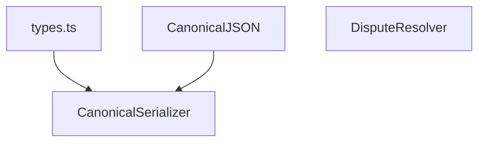
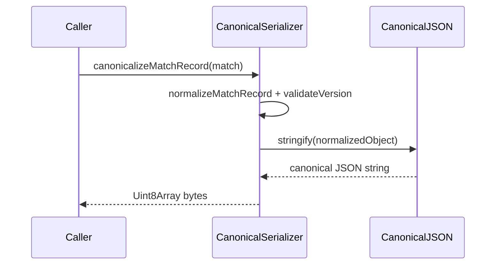
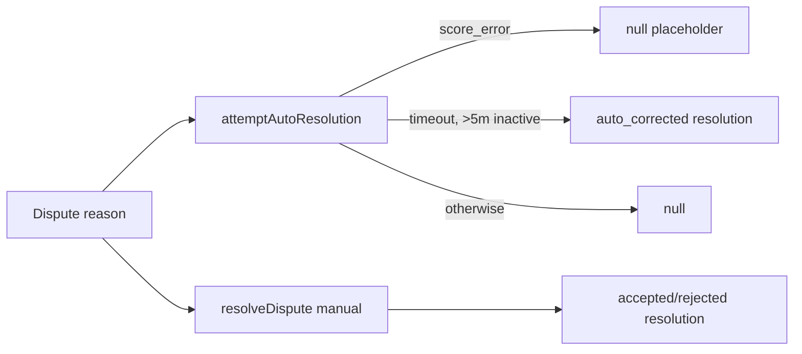

# verification-domain — architecture

## Role

`@ocentra/verification-domain` transforms match records into deterministic canonical
bytes and provides dispute decision helpers. It is a pre-crypto verification layer.

## Module map

- `types.ts` defines `MatchRecord`, `PlayerRecord`, `MoveRecord`, and
  `SignatureRecord` wire shapes (including compatibility aliases).
- `CanonicalJSON` handles key ordering and number/string normalization.
- `CanonicalSerializer` maps and validates `MatchRecord` fields, then emits bytes.
- `DisputeResolver` handles auto/manual dispute resolution outcomes.

## Canonicalization flow

## Dispute flow

## Boundaries

- No hashing/signing logic here (belongs to crypto-domain).
- No storage/event bus/network dependencies in this package.
- Output bytes are deterministic for semantically equivalent input records.
