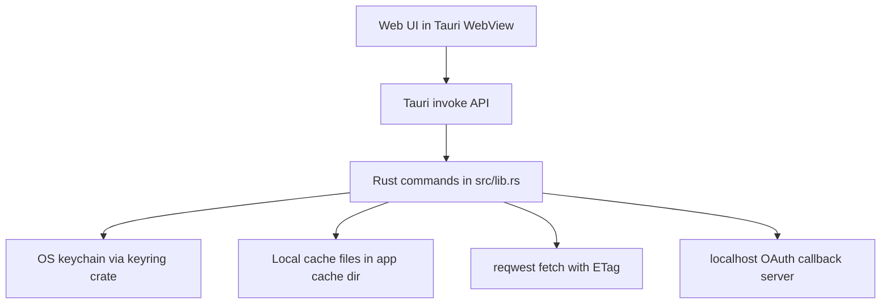
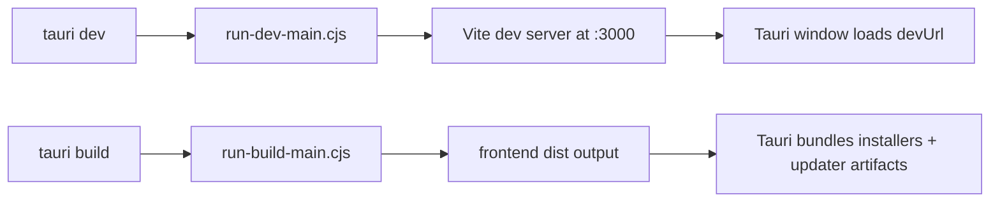

# Desktop Tauri Architecture

## Overview

Desktop is a Tauri host around the shared web app bundle.
Rust command handlers bridge UI requests to native features.



## Startup and build flow



Desktop dev startup is orchestrated from workspace scripts and can reuse:

- shared local worker on `:8787`
- warm Turbo state from recent runs

## App runtime composition

```mermaid
flowchart TB
  MAIN[src/main.rs]
  LIB[src/lib.rs run()]
  PLUGINS[Tauri plugins]
  WINDOW[Main window]
  TRAY[Tray icon]

  MAIN --> LIB
  LIB --> PLUGINS
  LIB --> WINDOW
  LIB --> TRAY

  PLUGINS --> OPENER[opener]
  PLUGINS --> SHELL[shell]
  PLUGINS --> STATE[window-state]
  PLUGINS --> UPDATER[updater]
```

## Native command groups

- **Auth and secrets**
  - `get_auth_token`, `store_auth_token`
  - `get_secret`, `store_secret`
- **OAuth callback**
  - `start_oauth_server` (binds `127.0.0.1:8766`)
- **Cache storage**
  - entry index, assets, images, slice key-value operations
- **Remote fetch**
  - `fetch_remote_resource(url, if_none_match)`

## Window lifecycle

- Close request is prevented.
- App hides window and keeps running in tray.
- Window state is persisted before hide.

## Boundaries

- Business logic remains in web app packages.
- Tauri layer handles desktop-native integration only.

## Auth resolution model

- Desktop-preferred token path: `get_auth_token` command bridge from Rust.
- Web fallback path: Firebase web SDK token resolution.
- Admin routes require a resolved bearer token before first protected API call.
