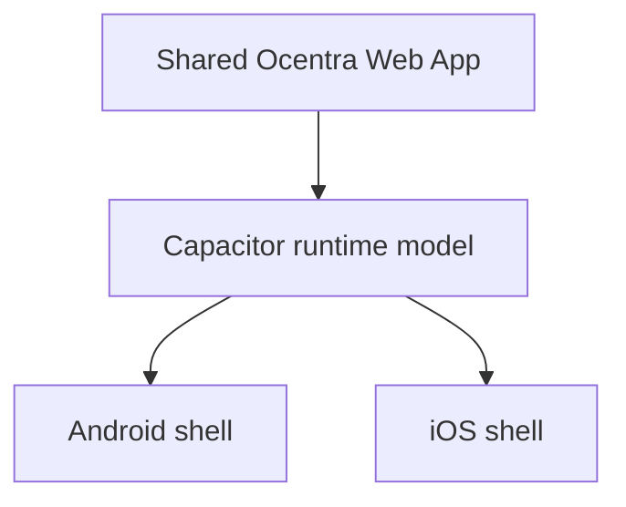
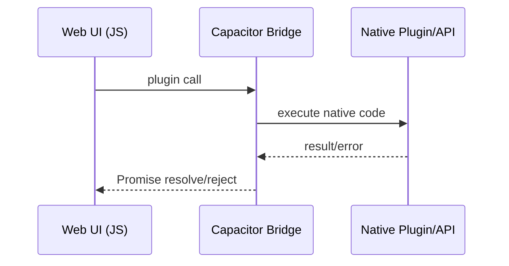
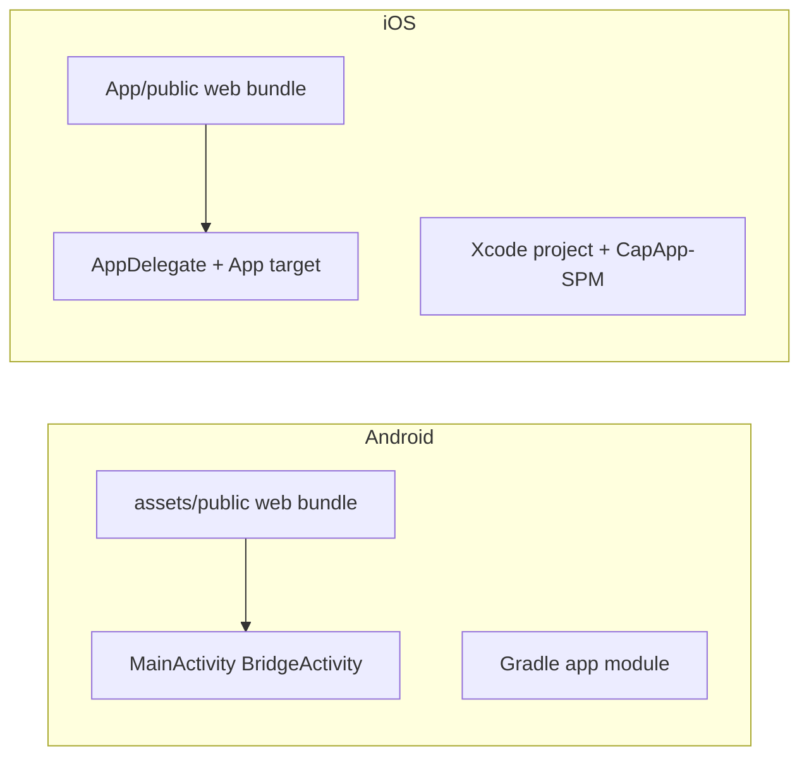

# Mobile Architecture Overview

## Cross-platform model

The same web runtime is packaged into platform-specific native containers.

## Runtime request path

## Platform architecture split

## Deep-link and auth callback

Both mobile targets are wired for OAuth callback handling via URL scheme:

- Scheme: `ocentra`
- Host/path mapping handled in platform manifests/plists and app delegates.

## Boundaries

- Mobile shell owns native lifecycle, packaging, and plugin bridge.
- App feature logic remains in shared TypeScript/web packages.
