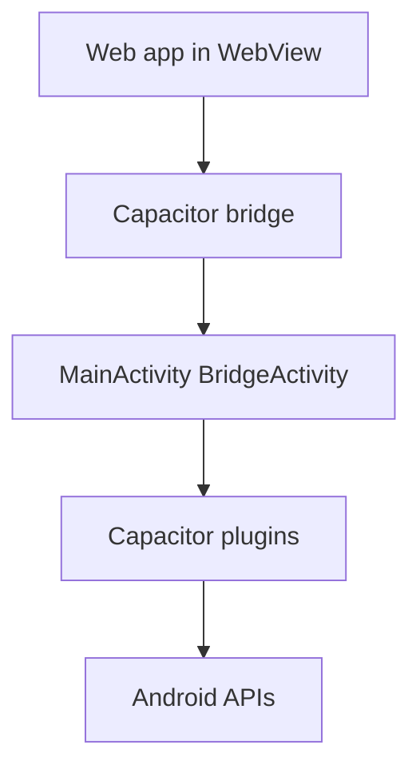
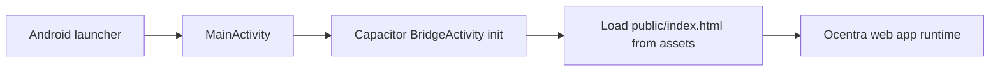
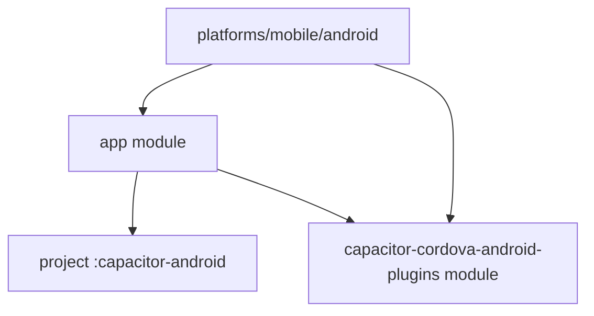

# Android Architecture (Capacitor)

## Overview

Android uses a thin native shell around the shared web app.
Capacitor bridges JavaScript calls to native plugin code.

## App startup flow

## Build and module graph

## Deep link and auth callback

`AndroidManifest.xml` declares:

- launcher intent filter
- browsable deep link intent:
  - scheme: `ocentra`
  - host: `oauth`

This enables OAuth callback routing into the app.

## Boundaries

- Android layer manages packaging, activity lifecycle, and plugin bridge.
- Feature logic and rendering remain in shared web packages.
