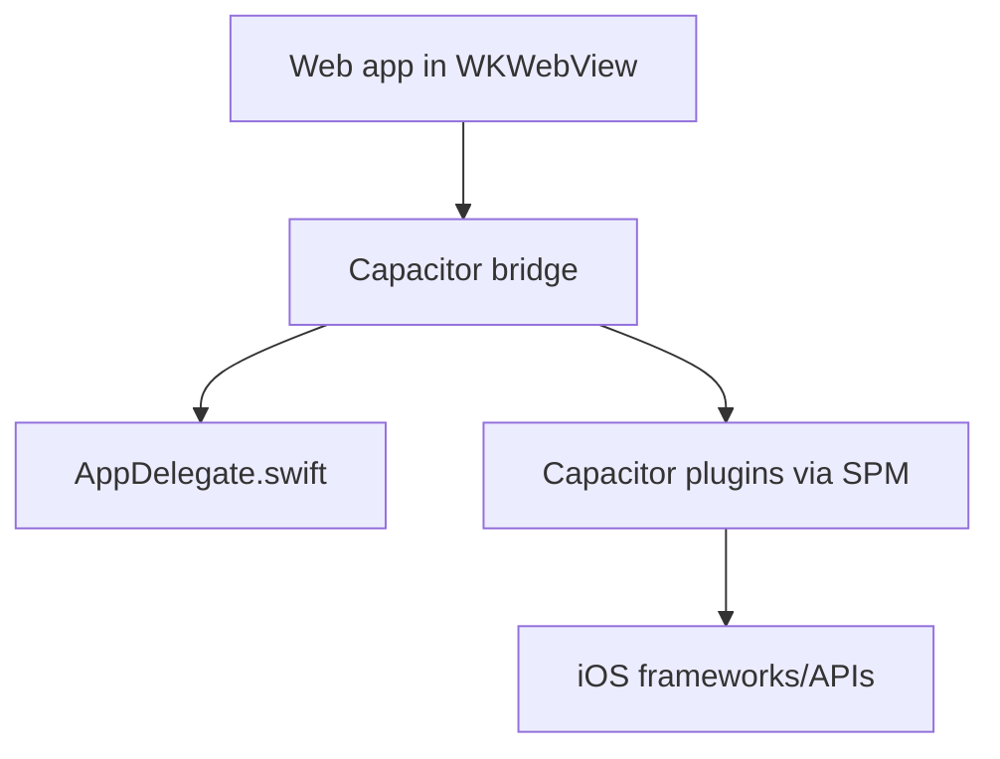
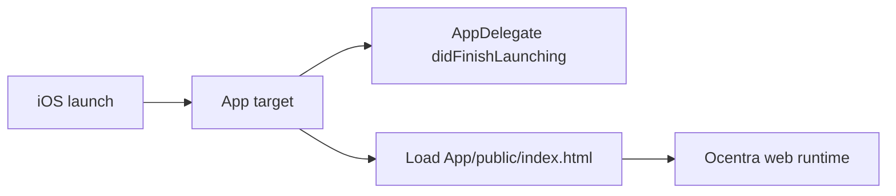
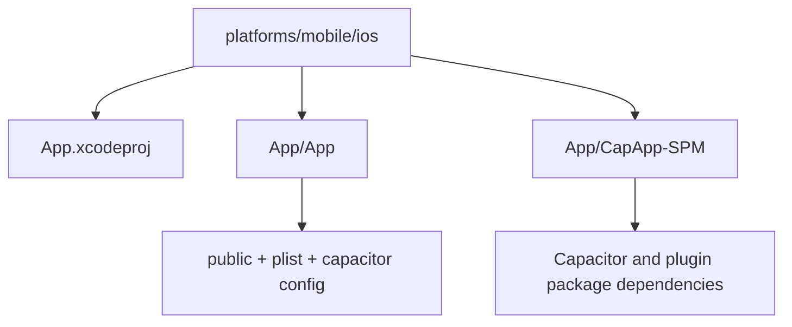

# iOS Architecture (Capacitor)

## Overview

iOS uses a native shell with Capacitor bridge around the shared web app.
The app target embeds web resources and delegates URL handling to Capacitor.

## Startup flow

## Project structure

## Deep links and URL handling

- `Info.plist` registers URL scheme `ocentra`.
- `AppDelegate` forwards `open url` and `continue userActivity` to
  `ApplicationDelegateProxy` so Capacitor App API can track app opens.

## Boundaries

- iOS shell owns native app lifecycle and packaging.
- Shared web app owns feature logic and UI.
