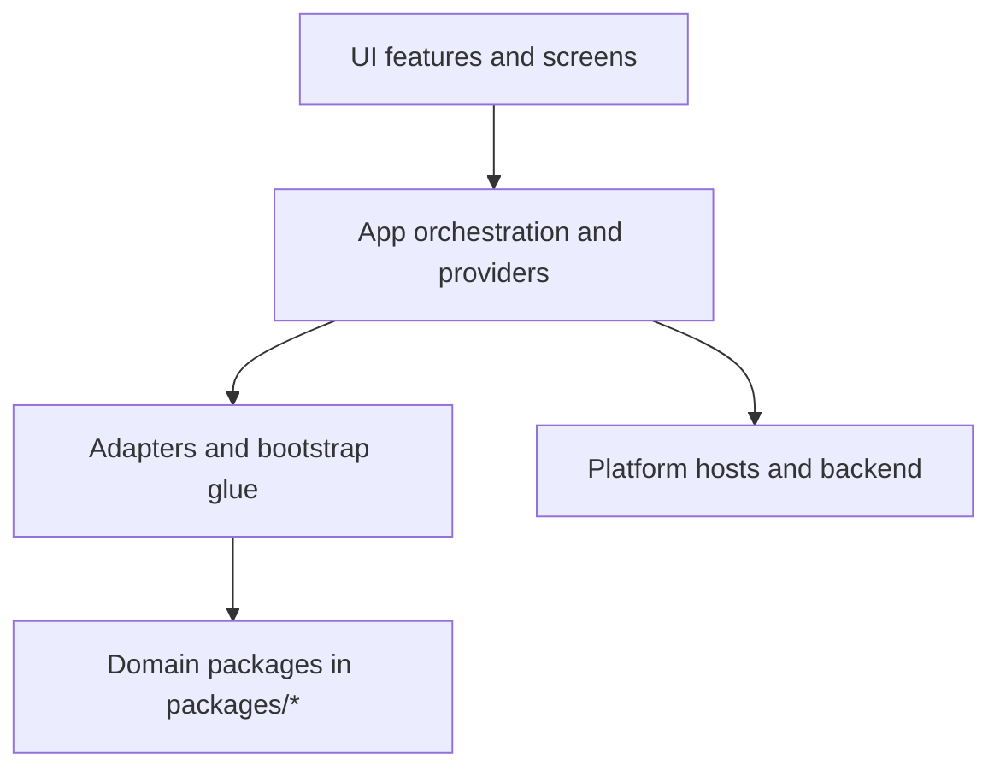
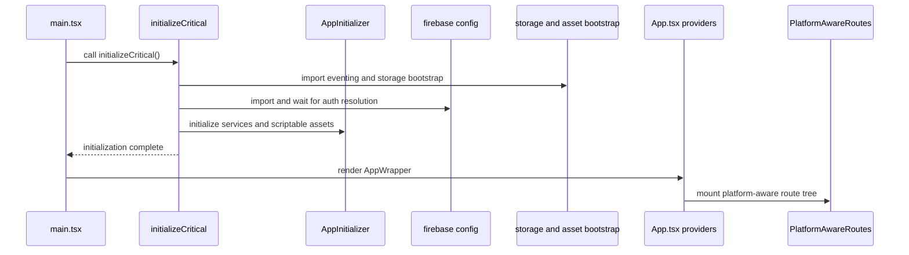
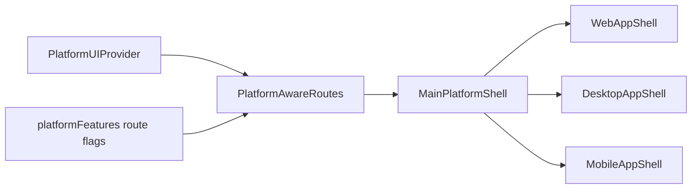

# Main App Architecture (`src`)

## Purpose

`src` is the application composition layer for the main app.
It orchestrates:

- React UI and route-driven features
- platform-aware shell behavior
- domain package adapters
- startup and runtime initialization

## Layer Model

## Runtime Boot Sequence

## Routing and Platform Selection

## Domain Integration Responsibilities

- `src/lib/core/AppInitializer.ts`
  - wires `@ocentra/asset-domain`, `@ocentra/app-core`,
    `@ocentra/storage-domain`, `@ocentra/ai-domain`, and logging.
- `src/bootstrap/storageBootstrap.ts`
  - selects platform storage bootstrap path and host integrations.
- `src/adapters/ai/aiDomainAppBootstrap.ts`
  - bridges runtime storage/auth/platform into `@ocentra/ai-domain`.
- `src/adapters/network/NetworkRouter.ts`
  - app-side routing bridge for `@ocentra/network-domain`.
- `src/adapters/solana/*`
  - wallet and Solana bridge wiring for `@ocentra/solana-domain`.

## Integration Boundaries

- `src` consumes domain APIs; it should avoid duplicating domain constants.
- `src` remains platform-agnostic at feature level, then delegates to
  platform adapters and shell variants.
- Native details stay in `platforms/*`; `src` only uses runtime bridges.

## Platform Linkage

How `src` connects to host projects:

- Desktop host docs: `platforms/desktop/tauri/ARCHITECTURE.md`
- Mobile host docs: `platforms/mobile/ARCHITECTURE.md`
- Android details: `platforms/mobile/android/ARCHITECTURE.md`
- iOS details: `platforms/mobile/ios/ARCHITECTURE.md`

## Suggested Reading Order

1. `README.md` in this folder
2. `main.tsx`
3. `lib/core/AppInitializer.ts`
4. `ui/routes/PlatformAwareRoutes.tsx`
5. `platforms/*` architecture docs
