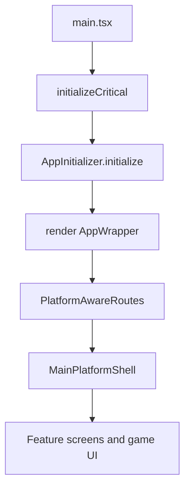

# Main App (`src`)

`src` is the main Ocentra web application codebase.
It is the UI/runtime composition layer that wires domain packages,
platform adapters, routing, and app bootstrap into a single app shell.

## What `src` Owns

- App startup and initialization flow (`main.tsx`, `lib/core/AppInitializer.ts`)
- React providers and routing (`App.tsx`, `ui/routes/PlatformAwareRoutes.tsx`)
- Platform-specific UI/shell selection (`ui/shell`, `ui/platform`)
- Adapter wiring from app to domains (`adapters/*`, `bootstrap/*`)
- Feature screens and pages (`ui/features`, `ui/pages`, `components`)

## What `src` Does Not Own

- Core shared contracts and business modules in `packages/*`
- Platform host projects under `platforms/*`
- Cloudflare worker backend under `infra/cloudflare`

## Top-Level Structure

- `adapters`: app-to-domain bridges (AI, assets, auth, storage, network, solana)
- `bootstrap`: startup wiring and runtime registration
- `lib`: app-core orchestration, event wiring, managers, logging glue
- `providers`: React providers (auth, query, platform context)
- `ui`: feature routes, pages, shells, and shared UI components
- `services`: app-level service implementations and integration tests
- `store`: client state stores
- `hooks`, `types`, `utils`, `constants`: app utilities and contracts

## Startup Flow

## Domain Packages Used By `src`

Major domain dependencies consumed directly in `src` include:

- `@ocentra/app-core`
- `@ocentra/asset-domain`
- `@ocentra/game-asset-domain`
- `@ocentra/game-domain`
- `@ocentra/ai-domain`
- `@ocentra/storage-domain`
- `@ocentra/network-domain`
- `@ocentra/solana-domain`
- `@ocentra/endpoint-domain`
- `@ocentra/eventing-domain`
- `@ocentra/logging-domain`
- `@ocentra/verification-domain`
- `@ocentra/credentials-domain`
- `@ocentra/auth-domain`

`src` mainly composes and configures these domains.
Shared business logic should stay in domains, not inside UI feature files.

## Platform Relationship

`src` is reused across web, desktop, and mobile shells.

- Web: runs directly in browser via Vite.
- Desktop: bundled web app loaded by Tauri host.
- Mobile: bundled web app loaded by Capacitor Android/iOS hosts.

Platform docs:

- [Platforms Overview](../platforms/README.md)
- [Desktop Tauri](../platforms/desktop/tauri/README.md)
- [Mobile Overview](../platforms/mobile/README.md)
- [Android Host](../platforms/mobile/android/README.md)
- [iOS Host](../platforms/mobile/ios/README.md)

## Related Docs

- `ARCHITECTURE.md`
- `adapters/README.md`
- `services/README.md`
