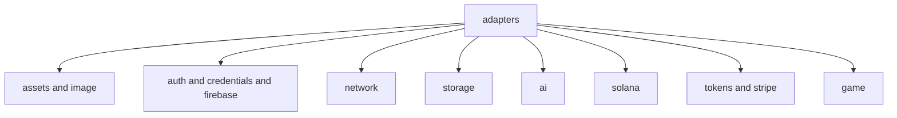
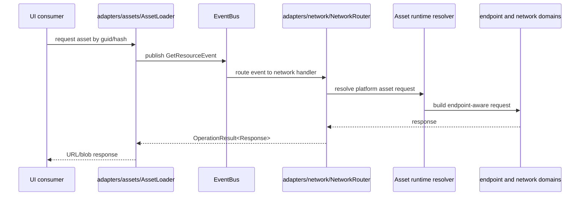
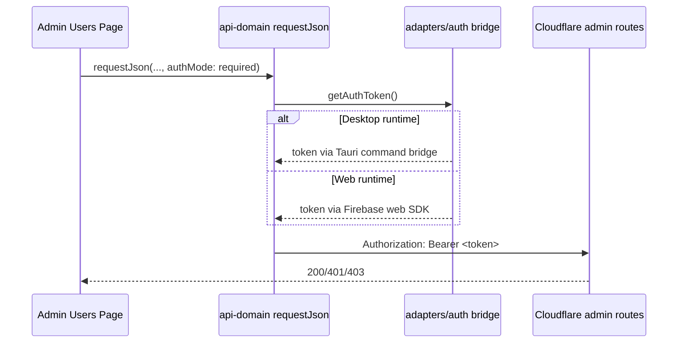

# Adapters Architecture (`src/adapters`)

## Purpose

Adapters are boundary translators between:

- app runtime specifics (web/desktop/mobile hosts, browser APIs)
- domain contracts from `packages/*`

They keep UI and services from talking directly to raw infra details.

## Adapter Layer Model

```mermaid
flowchart LR
  UI[UI and hooks]
  SVC[App services and bootstrap]
  ADP[src/adapters]
  DOM[@ocentra/* domain packages]
  HOST[Platform hosts and external SDKs]

  UI --> ADP
  SVC --> ADP
  ADP --> DOM
  ADP --> HOST
```

## Main Adapter Families



## Event-Driven Resource Path



## Platform-Specific Adapter Selection

Adapters commonly branch by runtime:

- auth bridge: web vs desktop vs native
- storage backend bridge: web IDB vs desktop path-resolver vs mobile backend
- shell-aware and platform-aware asset/image cache choices

This logic depends on runtime from `@ocentra/app-core/platform`.

## Admin auth flow across runtimes



Desktop and web OAuth are intentionally different host paths, but both must produce the same Firebase bearer token contract for protected worker APIs.

## Domain Dependencies (Typical)

High-usage domain packages from adapters include:

- `@ocentra/asset-domain`
- `@ocentra/eventing-domain`
- `@ocentra/endpoint-domain`
- `@ocentra/network-domain`
- `@ocentra/storage-domain`
- `@ocentra/ai-domain`
- `@ocentra/solana-domain`
- `@ocentra/auth-domain`
- `@ocentra/credentials-domain`
- `@ocentra/logging-domain`

## Platform Host Connections

Adapter behavior is consumed by platform shells documented in:

- `../../platforms/desktop/tauri/README.md`
- `../../platforms/mobile/README.md`
- `../../platforms/mobile/android/README.md`
- `../../platforms/mobile/ios/README.md`
