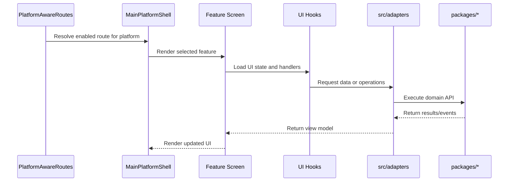
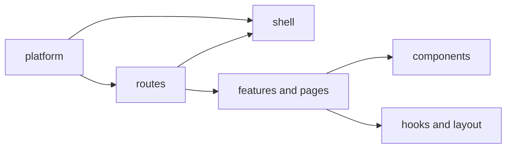

# UI Architecture (`src/ui`)

## Scope

This layer is responsible for rendering and user interaction.
It does not own persistent business rules, protocol contracts,
or host-native runtime details.

## Core Flow

## Structure and Responsibilities

- `routes`: route gating and lazy imports.
- `shell`: host-specific visual shell wrappers.
- `platform`: runtime-aware UI context and selection helpers.
- `features/pages`: feature composition and route-target modules.
- `components`: reusable view building blocks.
- `hooks/layout`: UI-local state, layout, and rendering helpers.

## Route Gating Model

`PlatformAwareRoutes` evaluates route definitions from
`config/platformFeatures.ts` using:

- current shell (`web`, `desktop`, `mobile`)
- environment mode (`import.meta.env.DEV`)
- per-feature dev-only and platform support settings

This keeps one route source while enabling per-platform behavior.

## Platform Linkage

UI shell variants map to host platforms:

- web shell for browser runtime
- desktop shell for Tauri runtime
- mobile shell for Capacitor runtime

Host implementation docs:

- `../../platforms/desktop/tauri/ARCHITECTURE.md`
- `../../platforms/mobile/ARCHITECTURE.md`
- `../../platforms/mobile/android/ARCHITECTURE.md`
- `../../platforms/mobile/ios/ARCHITECTURE.md`

## Dependency Direction

UI should follow this direction:

- `ui/*` -> `hooks/*`, `providers/*`, `adapters/*` -> `@ocentra/* domains`

Avoid reverse dependency from domain packages to `src/ui`.
