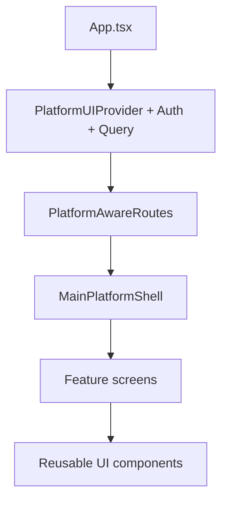

# UI Layer (`src/ui`)

`src/ui` contains the app-facing presentation layer:

- route trees
- platform-aware shells
- feature screens
- reusable UI components

It consumes domain-backed data and behaviors through app adapters,
providers, and hooks.

## Folder Map

- `routes`: app route definitions and lazy feature mounting
- `shell`: shell variants for web, desktop, and mobile
- `platform`: platform UI context, runtime variant selection, debug overlay
- `features`: screen-level feature modules
- `pages`: page wrappers and route page entry components
- `components`: reusable visual components and game UI
- `layout`: layout and table UI presets
- `navigation`, `hooks`, `gameMode`: routing helpers and game UI state hooks

## UI Runtime Model

## Platform Awareness In UI

- Platform shell selection is driven by `usePlatformUI` and `usePlatformVariant`.
- Route availability is controlled by `config/platformFeatures.ts`.
- Some routes are dev-only and restricted to web/desktop at runtime.
- The same feature modules are rendered inside different shell containers.

## Domain Touchpoints Seen In UI

Common direct domain usage in UI modules includes:

- `@ocentra/eventing-domain` for event-driven UI triggers
- `@ocentra/game-domain` and `@ocentra/game-asset-domain` for game data
- `@ocentra/core-ui` for shared UI contracts/components
- `@ocentra/logging-domain` for structured logs
- `@ocentra/ai-domain` and `@ocentra/solana-domain` in feature-specific flows

Domain-heavy logic should remain in domains and adapters.
UI should mostly render state and invoke actions.

## Related Docs

- `ARCHITECTURE.md`
- `../README.md`
- `../adapters/README.md`
- `../../platforms/README.md`
